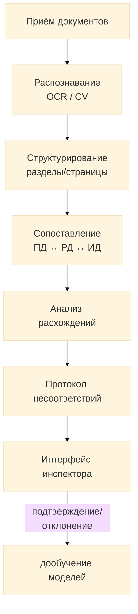

# Hakaton-LDT

## DocControl AI — сервис сквозного контроля проектной документации

Автоматическое сопоставление проектной (ПД), рабочей (РД) и исполнительной (ИД) документации: распознавание текстовых, mp3 и графических данных, выявление критических расхождений и технологических ошибок, формирование цифрового протокола несоответствий с привязкой к разделам, страницам и координатам на чертежах.

## Содержание
1. [Архитектура](#архитектура)
2. [Структура репозитория](#структура-репозитория)
3. [Компоненты системы](#компоненты-системы)
4. [API](#api)
5. [Установка и запуск](#установка-и-запуск)
6. [Разработка и принимаемые решения](#разработка-и-принимаемые-решения)

### Архитектура
Файл: [[docs/arch.md]]
Система построена как пайплайн последовательной обработки документов с циклом обратной связи от инспектора для дообучения моделей:

## Основные модули
| Модуль | Назначение | Технологии |
|--------|------------|------------|
| **Ingestion** | Приём файлов, определение типа/стадии/версии документа | Python, очередь задач |
| **Recognition** | OCR текста, извлечение таблиц, векторизация чертежей (CV), транскрибация mp3 | Python, ML-модели |
| **Structuring** | Привязка сущностей к разделам, страницам, координатам | Python |
| **Matching** | Сопоставление текст↔текст, текст↔графика, графика↔графика | Python, ML |
| **Discrepancy Engine** | Классификация и ранжирование расхождений по критичности | Правила + ML-классификатор |
| **Protocol Service** | Формирование цифрового протокола несоответствий | Python, БД |
| **Inspector UI** | Интерфейс проверки: просмотр, подтверждение, отклонение | Frontend |
| **Feedback Loop** | Дообучение моделей на решениях инспекторов | ML pipeline |
---
## Структура репозитория
Файл: [[docs/repo.md]]
```
.
├── backend/                # 🔵 API-сервис и бизнес-логика
│   ├── src/
│   │   ├── ingestion/         # Приём файлов
│   │   ├── recognition/       # OCR и CV
│   │   ├── matching/          # Сопоставление
│   │   ├── discrepancy/       # Анализ расхождений
│   │   ├── protocol/          # Протокол несоответствий
│   │   └── api/               # REST API
│   ├── tests/                 # Модульные тесты
│   └── requirements.txt       # Python-зависимости
│
├── frontend/              # 🟢 Интерфейс инспектора
│   ├── src/                  # Исходники React/Vue
│   ├── public/               # Статика
│   └── package.json          # NPM-зависимости
│
├── ml/                     # 🟣 Модели машинного обучения
│   ├── ocr/                  # OCR-модели
│   ├── cv_drawings/          # CV для чертежей
│   ├── matching_models/      # Модели сопоставления
│   ├── training/             # Скрипты обучения
│   └── notebooks/            # Jupyter/Colab
│
├── docs/                   # 📖 Документация
│   ├── architecture.md       # Архитектура
│   └── api-reference.md      # API-справочник
│
├── infra/                  # 🏗️ Инфраструктура
│   ├── docker-compose.yml    # Docker Compose
│   └── k8s/                  # Kubernetes
│       ├── deployment.yaml
│       └── service.yaml
│
├── .env.example            # ⚙️ Переменные окружения
└── README.md               # 📋 Описание проекта
```
## Компоненты системы
Файл: [[docs/components.md]]
### 🖥️ Backend

**Назначение:** REST/gRPC API, оркестрация пайплайна обработки документов, хранение метаданных и результатов сопоставления.

**Технологии:** Python, FastAPI, PostgreSQL, Redis, Celery

**Основные модули:**
- `ingestion` — приём и валидация документов
- `recognition` — OCR и CV-обработка
- `matching` — сопоставление сущностей
- `discrepancy` — анализ расхождений
- `protocol` — формирование протокола

---

### 🎨 Frontend

**Назначение:** Веб-интерфейс инспектора: просмотр документов рядом друг с другом, подсветка расхождений на чертежах, подтверждение/отклонение в один клик.

**Технологии:** React, TypeScript, WebSocket, Canvas

**Ключевые возможности:**
- 🔍 Синхронный просмотр ПД/РД/ИД
- 🎯 Подсветка расхождений на чертежах
- ✅ Подтверждение/отклонение в один клик
- 📊 Фильтрация по критичности

---

### 🤖 ML

**Назначение:** Модели OCR, распознавания графических элементов чертежей (CV), транскрибация mp3, сопоставления сущностей и классификации критичности расхождений. Дообучаются на размеченных решениях инспекторов.

**Технологии:** Python, PyTorch, OpenCV, ONNX, MLflow

**Модели:**
- `OCR` — распознавание текста
- `CV Drawings` — распознавание графических элементов
- `Matching` — сопоставление сущностей
- `Classifier` — классификация критичности

---

### API
Файл: [[docs/api.md]]
**Базовый URL:** `https://api.doccontrol.example.com/v1`

**Протоколы:** REST + gRPC
### Основные эндпоинты

### 📄 Документы

| Метод | Путь | Описание |
|:------|:-----|:---------|
| `POST` | `/documents` | Загрузка документа (ПД/РД/ИД) |
| `GET` | `/documents/{id}` | Получение метаданных документа |
| `POST` | `/documents/{id}/process` | Запуск распознавания и структурирования |
| `GET` | `/documents/{id}/entities` | Извлечённые сущности с привязкой к разделам/страницам |

### 🔗 Сопоставление

| Метод | Путь | Описание |
|:------|:-----|:---------|
| `POST` | `/comparisons` | Запуск сопоставления между указанными документами/стадиями |
| `GET` | `/comparisons/{id}/discrepancies` | Список выявленных расхождений |

### 📋 Протоколы и верификация

| Метод | Путь | Описание |
|:------|:-----|:---------|
| `GET` | `/protocols/{id}` | Цифровой протокол несоответствий |
| `PATCH` | `/discrepancies/{id}` | Подтверждение/отклонение расхождения инспектором |
---

### Примеры запросов

### 🔗 Запуск сопоставления

**Эндпоинт:** `POST /comparisons`

---

#### 📤 Запрос

```bash
curl -X POST https://api.doccontrol.example.com/v1/comparisons \
  -H "Authorization: Bearer <token>" \
  -H "Content-Type: application/json" \
  -d '{
    "base_document_id": "pd_2024_001",
    "target_document_id": "rd_2024_001",
    "scope": ["specifications", "drawings"]
  }'
```

**Параметры тела запроса:**

- `base_document_id` — идентификатор ПД (проектной документации)
- `target_document_id` — идентификатор РД (рабочей документации) или ИД
- `scope` — области проверки: `specifications` (спецификации), `drawings` (чертежи)

---

#### 📥 Ответ

```json
{
  "comparison_id": "cmp_7f3a",
  "status": "completed",
  "discrepancies_found": 12,
  "critical_count": 3
}
```

**Поля ответа:**

| Поле | Описание |
|:-----|:---------|
| `comparison_id` | ID задачи для дальнейшего отслеживания |
| `status` | `pending` / `processing` / `completed` / `failed` |
| `discrepancies_found` | Общее количество расхождений |
| `critical_count` | Из них критических (требуют обязательного исправления) |

#### Подробное описание всех эндпоинтов — в docs/api-reference.md.

### Установка и запуск
Файл: [[docs/installation.md]]
Требования: 
1. Python 3.11+
2. Node.js 20+
3. Docker и Docker Compose \ K8s
4. PostgreSQL 15+

### Разработка и принимаемые решения
- Всё, что связано с разработкой - в файле [[docs/dev_diary]]