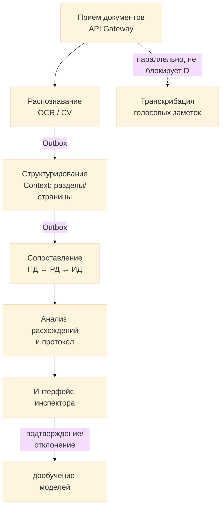

# Hakaton-LDT

## DocControl AI — сервис сквозного контроля проектной документации

Автоматическое сопоставление проектной (ПД), рабочей (РД) и исполнительной (ИД) документации: распознавание текстовых, аудио- и графических данных, выявление критических расхождений и технологических ошибок, формирование цифрового протокола несоответствий с привязкой к разделам, страницам и координатам на чертежах.

## Содержание
1. [Архитектура](#архитектура)
2. [Структура репозитория](#структура-репозитория)
3. [Компоненты системы](#компоненты-системы)
4. [API](#api)
5. [Установка и запуск](#установка-и-запуск)
6. [Разработка и принимаемые решения](#разработка-и-принимаемые-решения)

---

### Архитектура
Файл: [[docs/arch.md]]

Система построена как **event-driven пайплайн** на Kafka с гарантией at-least-once доставки и effectively-once бизнес-эффекта (Outbox pattern + идемпотентные consumer'ы). Каждый шаг обработки — независимый Python-сервис, триггерящий следующий шаг напрямую через запись в Outbox, без центрального оркестратора на happy path. Voice-транскрибация — независимый параллельный процесс, не блокирующий сопоставление документов.



Отдельно от happy path работает **Saga Orchestrator** — не координатор пайплайна, а детектор сбоев и таймаутов шагов OCR/Context (слушает DLQ-топики и сигналы от Timeout Scanner), инициирующий асинхронную компенсацию через `Compensation Worker`.

Подробности: диаграмма компонентов, sequence-диаграмма полного потока обработки, DDD-декомпозиция Gateway, схемы Kafka-топиков и DDL хранилищ — в [`docs/arch.md`](docs/arch.md).

---

## Основные модули

| Модуль | Назначение | Технологии |
|--------|------------|------------|
| **API Gateway** | Приём HTTP-запросов, аутентификация, идемпотентность на входе, Outbox-запись начальных событий | Go |
| **OCR Worker** | Распознавание текста, извлечение таблиц, векторизация чертежей (CV) | Python, Tesseract/EasyOCR, OpenCV |
| **Context Worker** | Привязка сущностей к разделам, страницам, координатам; **единственный источник** триггера Matching | Python, NER |
| **Matching Worker** | Сопоставление текст↔текст, текст↔графика, графика↔графика; классификация критичности расхождений | Python, ML |
| **Voice Worker** | Транскрибация голосовых заметок инспектора (независимый параллельный процесс) | Python, Whisper/Vosk |
| **Compensation Worker** | Асинхронная очистка временных артефактов при сбое задачи | Python |
| **Saga Orchestrator** | Обнаружение сбоев/таймаутов OCR/Context (DLQ + Timeout Scanner), запуск компенсации | Go, часть API Gateway |
| **Outbox Relay** | Атомарная публикация событий из PostgreSQL в Kafka (`SELECT ... SKIP LOCKED`) | Go |
| **Notification Relay** | Трансляция completion-событий из Kafka в WebSocket для клиента | Go |
| **Inspector UI** | Интерфейс проверки: просмотр, подтверждение, отклонение | React, TypeScript, FSD |
| **Feedback Loop** | Дообучение моделей на решениях инспекторов (`PATCH /discrepancies/{id}`) | ML pipeline |

---

## Структура репозитория
Файл: [[docs/repo.md]]

```
.
├── gateway/                 # 🔵 API Gateway + Saga + Outbox Relay + Notification Relay (Go)
│   ├── internal/
│   │   ├── transport/          # HTTP handlers, DTO, middleware (JWT, idempotency, tenant)
│   │   ├── application/        # Use-cases: CreateTask, ConfirmUpload, FailTask
│   │   ├── domain/              # Bounded contexts: Task, Document, VoiceNote, Identity
│   │   ├── persistence/         # PostgreSQL repos, Outbox, Kafka producer/consumer
│   │   └── saga/                 # Failure/timeout detection, компенсация
│   └── go.mod
│
├── worker-core/             # ⚙️ Переиспользуемое ядро Python-воркеров (отдельный пакет)
│   ├── worker_core/
│   │   ├── kafka/               # consumer/producer, correlation_id
│   │   ├── db/                  # SQLAlchemy engine, транзакции
│   │   ├── idempotency.py       # consumed_events
│   │   ├── outbox.py            # запись outbox_events
│   │   ├── tracing.py           # OpenTelemetry
│   │   └── base_worker.py       # BaseWorker — шаблонный метод run()/handle()
│   └── pyproject.toml           # версионируется отдельно (semver), приватный PyPI
│
├── services/                # 🟣 BL-сервисы — только бизнес-логика поверх worker-core
│   ├── ocr-worker/
│   ├── context-worker/
│   ├── matching-worker/
│   ├── voice-worker/
│   └── compensation-worker/
│
├── timeout-scanner/         # ⏱️ CronJob: сканирование зависших шагов в task_processing_steps
│
├── frontend/                 # 🟢 Интерфейс инспектора (Feature-Sliced Design)
│   ├── src/
│   │   ├── app/ pages/ widgets/ features/ entities/ shared/
│   └── package.json
│
├── ml/                       # 🟠 Модели машинного обучения
│   ├── ocr/                     # OCR-модели
│   ├── cv_drawings/             # CV для чертежей
│   ├── matching_models/         # Модели сопоставления
│   ├── voice/                   # Speech-to-Text модели
│   ├── training/                # Скрипты обучения (Feedback Loop)
│   └── notebooks/
│
├── docs/                      # 📖 Документация
│   ├── arch.md                  # Полная архитектура: диаграммы, DDL, Kafka-схемы
│   └── api-reference.md         # API-справочник
│
├── infra/                     # 🏗️ Инфраструктура
│   ├── docker-compose.yml
│   └── k8s/
│       ├── gateway/
│       ├── workers/               # Deployment + KEDA ScaledObject на каждый воркер
│       ├── outbox-relay/
│       └── timeout-scanner/       # CronJob
│
├── .env.example
└── README.md
```

---

## Компоненты системы
Файл: [[docs/components.md]]

### 🚪 API Gateway

**Назначение:** единая точка входа для внешних запросов — аутентификация, валидация, идемпотентность на входе (`Idempotency-Key`), запись начальных событий в Outbox. Дополнительно в том же процессе работают **Saga Orchestrator** (детектор сбоев/таймаутов), **Outbox Relay** (публикация событий в Kafka) и **Notification Relay** (трансляция completion-событий в WebSocket).

**Технологии:** Go, PostgreSQL (через Repository/Outbox), Kafka producer/consumer, Redis (кэш, не источник истины)

**Архитектура:** Domain-Driven Design — bounded contexts `Task Management`, `Document Processing`, `Voice Notes`, `Identity`; слои Transport (ACL) → Application (use-cases) → Domain (агрегаты) → Persistence.

---

### ⚙️ BL-воркеры (Python)

**Назначение:** асинхронная обработка одного шага пайплайна каждый. Каждый шаг сам, в собственной PostgreSQL-транзакции, сохраняет результат и публикует событие для следующего шага через Outbox — без центрального координатора.

**Технологии:** Python, `worker-core` (общая инфраструктура: Kafka consumer/producer, транзакции, идемпотентность, graceful shutdown), ML-модели (Tesseract/EasyOCR, OpenCV, NER, Whisper/Vosk)

**Сервисы:**
- `ocr-worker` — OCR, извлечение таблиц, векторизация чертежей; если Context не требуется для `task_type` — сам публикует триггер Matching
- `context-worker` — структурирование, NER; единственный владелец публикации `doc.matching.requested`, когда Context нужен
- `matching-worker` — сопоставление сущностей, классификация расхождений; терминальный шаг — сам обрабатывает собственный сбой
- `voice-worker` — транскрибация голосовых заметок; независимый параллельный процесс, не влияет на запуск Matching
- `compensation-worker` — асинхронная очистка временных артефактов при сбое задачи

---

### 🎨 Frontend

**Назначение:** веб-интерфейс инспектора: просмотр документов side-by-side, подсветка расхождений на чертежах, подтверждение/отклонение в один клик, запись и прослушивание голосовых заметок.

**Технологии:** React, TypeScript, WebSocket (от Notification Relay), Canvas

**Архитектура:** Feature-Sliced Design (app → pages → widgets → features → entities → shared)

**Ключевые возможности:**
- 🔍 Синхронный просмотр ПД/РД/ИД
- 🎯 Подсветка расхождений на чертежах
- ✅ Подтверждение/отклонение в один клик
- 📊 Фильтрация по критичности
- 🎙️ Запись голосовых заметок с real-time транскрипцией
- 🔄 Live-обновление статуса задачи по WebSocket с восстановлением состояния через `GET /tasks/{id}` при реконнекте

---

### 🤖 ML

**Назначение:** модели OCR, распознавания графических элементов чертежей (CV), транскрибации аудио, сопоставления сущностей и классификации критичности расхождений. Дообучаются на размеченных решениях инспекторов (Feedback Loop).

**Технологии:** Python, PyTorch, OpenCV, ONNX, MLflow

**Модели:**
- `OCR` — распознавание текста
- `CV Drawings` — распознавание графических элементов
- `Matching` — сопоставление сущностей
- `Classifier` — классификация критичности
- `Speech-to-Text` — транскрибация голосовых заметок

---

## API
Файл: [[docs/api.md]]

**Базовый URL:** `https://api.doccontrol.example.com/v1`

**Протокол:** REST (внешний клиентский API) + WebSocket (real-time статус и результаты). Внутреннее взаимодействие между Gateway и обрабатывающими сервисами — исключительно через Kafka, без gRPC или прямых синхронных вызовов между сервисами (см. [`docs/dev_diary`](docs/dev_diary) — обоснование этого решения).

**Модель API — асинхронная.** Любая операция обработки (OCR/Context/Matching/Voice) запускается через `POST`, который немедленно возвращает `task_id` и промежуточный статус, а не готовый результат. Финальный результат получают либо через polling `GET /tasks/{id}`, либо через WebSocket-подписку.

### Основные эндпоинты

### 📄 Документы

| Метод | Путь | Описание |
|:------|:-----|:---------|
| `POST` | `/documents` | Загрузка документа (ПД/РД/ИД) |
| `GET` | `/documents/{id}` | Получение метаданных документа |
| `GET` | `/documents/{id}/entities` | Извлечённые сущности с привязкой к разделам/страницам (после завершения обработки) |

### 📋 Задачи (создание, загрузка файла, запуск пайплайна — единая ручка)

| Метод | Путь | Описание |
|:------|:-----|:---------|
| `POST` | `/tasks` | Создание задачи. `operation: "create"` — получение `upload_url`; `operation: "confirm_upload"` — подтверждение загрузки и запуск пайплайна |
| `GET` | `/tasks/{id}` | Текущий статус задачи и доступные результаты (`status`, `results`, `protocol_url`, `transcript`) |
| `WS` | `/tasks/{id}/subscribe` | Подписка на live-обновления статуса (`task.progress.updated`, `voice.transcribe.completed` и др.) |

### 📋 Протоколы и верификация

| Метод | Путь | Описание |
|:------|:-----|:---------|
| `GET` | `/protocols/{id}` | Цифровой протокол несоответствий |
| `PATCH` | `/discrepancies/{id}` | Подтверждение/отклонение расхождения инспектором (источник данных для Feedback Loop) |

---

### Пример запроса

### 📋 Создание задачи на сопоставление документов

**Эндпоинт:** `POST /tasks`

---

#### 📤 Запрос

```bash
curl -X POST https://api.doccontrol.example.com/v1/tasks \
  -H "Authorization: Bearer <token>" \
  -H "Content-Type: application/json" \
  -H "Idempotency-Key: 3f7a9c2e-..." \
  -d '{
    "operation": "create",
    "task_type": "compare",
    "base_document_id": "pd_2024_001",
    "target_document_id": "rd_2024_001",
    "scope": ["specifications", "drawings"]
  }'
```

**Параметры тела запроса:**

- `operation` — `create` (первая фаза) или `confirm_upload` (после загрузки файла по presigned URL)
- `task_type` — определяет, какие шаги пайплайна включаются (`compare`, `upload_and_process`, `process_only`)
- `base_document_id` — идентификатор ПД (проектной документации)
- `target_document_id` — идентификатор РД (рабочей документации) или ИД
- `scope` — области проверки: `specifications` (спецификации), `drawings` (чертежи)

---

#### 📥 Ответ

Задача создана и поставлена в обработку — результат ещё не готов:

```json
{
  "task_id": "task_7f3a",
  "status": "processing",
  "upload_url": null
}
```

Финальный результат — через `GET /tasks/task_7f3a` или WebSocket-подписку, когда пайплайн (OCR → Context → Matching) завершится:

```json
{
  "task_id": "task_7f3a",
  "status": "completed",
  "results": {
    "discrepancies_found": 12,
    "critical_count": 3
  },
  "protocol_url": "https://.../protocols/proto_9c1d"
}
```

**Поля ответа:**

| Поле | Описание |
|:-----|:---------|
| `task_id` | ID задачи для отслеживания через `GET /tasks/{id}` или WebSocket |
| `status` | `accepted` / `awaiting_upload` / `processing` / `completed` / `failed` / `failed_with_partial_results` |
| `results.discrepancies_found` | Общее количество расхождений (доступно после `completed`) |
| `results.critical_count` | Из них критических (требуют обязательного исправления) |
| `protocol_url` | Ссылка на цифровой протокол несоответствий |

#### Подробное описание всех эндпоинтов, Kafka-топиков и схем событий — в [`docs/api-reference.md`](docs/api-reference.md) и [`docs/arch.md`](docs/arch.md).

---

### Установка и запуск
Файл: [[docs/installation.md]]

Требования:
1. Go 1.22+ (API Gateway)
2. Python 3.11+ (BL-воркеры, ML)
3. Node.js 20+ (Frontend)
4. Docker и Docker Compose / K8s
5. PostgreSQL 15+
6. Apache Kafka 3+ (или совместимый брокер)
7. Redis 7+ (кэш, не обязателен для корректности — источник истины PostgreSQL)

---

### Разработка и принимаемые решения
- Архитектурные решения и их обоснование (в т.ч. почему event-driven через Kafka, а не gRPC/Celery между сервисами; почему Saga — только failure detector) — в файле [[docs/dev_diary]]