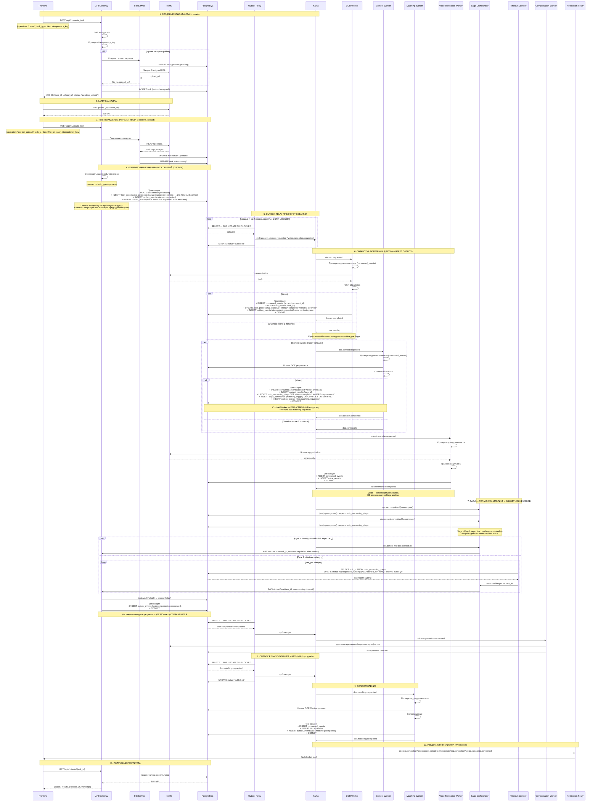

# Архитектура и бизнес-логика сервиса контроля документации

Документ описывает полный цикл работы системы: от приёма данных пользователем до формирования протокола несоответствий, включая работу event-driven ядра, масштабирование через K8s и обеспечение идемпотентности.

## Оглавление

1. [Общая архитектура компонентов](#общая-архитектура-компонентов)
2. [Поток обработки документа](#поток-обработки-документа)
3. [Структура frontend](#структура-frontend-fsd-architecture)
4. [Структура backend](#структура-backend-ddd-architecture)
5. [Структура шины событий](#структура-шины-событий-kafka)
6. [Структура воркеров](#структура-воркеров)
7. [Структура хранилищ](#структура-хранилищ)
8. [Структура системы оркестрации](#структура-системы-оркестрации)

---

## Общая архитектура компонентов

> **Ключевое архитектурное решение этой версии:** `doc.matching.requested` публикуется **только одним владельцем** — Context Worker'ом, синхронно (в одной транзакции) с сохранением своего результата, через Outbox. Saga Orchestrator **больше не дублирует** эту публикацию в happy path. Роль Saga сужена и чётко определена: **обнаружение сбоев и таймаутов** шагов OCR/Context и запуск компенсации. Это устраняет гонку двух источников истины за один и тот же INSERT.

```mermaid
graph TB
    subgraph Client["🖥️ КЛИЕНТСКИЙ СЛОЙ"]
        FE[Frontend<br>JS/TS]
        Note1[опционален для автономной работы]
    end

    subgraph Gateway["🚪 API GATEWAY (Go)"]
        GW[Приём запросов<br>Аутентификация<br>Валидация<br>Роутинг]
        FS[File Service модуль<br>Presigned URL<br>Метаданные]
        CMD[Command Handler<br>create_task]
        OUTBOX_TBL[(Outbox Table<br>в той же транзакции)]
        OUTBOX_RELAY[Outbox Relay<br>SKIP LOCKED claim]
        PROD[Kafka Producer]
        SAGA[Saga Orchestrator<br>Failure/Timeout Detector]
        TIMEOUT[Timeout Scanner<br>периодический job]
        NOTIFY[Notification Relay<br>Kafka → WebSocket]
    end

    subgraph Kafka["📨 KAFKA (шина событий)"]
        K1[doc.ocr.requested]
        K2[doc.context.requested]
        K3[doc.matching.requested]
        K4[doc.ocr.completed]
        K5[doc.context.completed]
        K6[doc.matching.completed]
        K7[voice.transcribe.requested]
        K8[voice.transcribe.completed]
        K9[file.upload.completed]
        K10[task.compensation.requested]
        DLQ1[doc.ocr.dlq]
        DLQ2[doc.context.dlq]
    end

    subgraph Workers["⚙️ Сервисы"]
        OCR[OCR-воркеры<br>Python]
        CTX[Context-воркеры<br>Python]
        MATCH[Matching-воркеры<br>Python]
        VOICE[Voice Transcribe<br>воркеры Python]
        COMP[Compensation Worker<br>Python]
    end

    subgraph Storage["💾 ХРАНИЛИЩА"]
        PG[(PostgreSQL<br>результаты, протоколы, outbox,<br>task_processing_steps)]
        MINIO[(MinIO<br>документы, чертежи, аудио)]
        REDIS[(Redis<br>кэш, быстрая координация)]
    end

    subgraph Orchestration["☸️ ОРКЕСТРАЦИЯ"]
        K8s[Kubernetes<br>Deployments + HPA/KEDA]
    end

    %% Единая ручка — две фазы
    FE -->|POST /api/v1/create_task| GW
    GW -->|обработка команды| CMD
    CMD -->|загрузка файлов| FS
    FS -->|Presigned URL| MINIO
    FS -->|метаданные| PG

    %% Outbox pattern: команда пишет агрегат + событие в одной транзакции
    CMD -->|INSERT агрегат + событие<br>+ task_processing_steps,<br>одна транзакция| PG
    PG -->|хранит| OUTBOX_TBL
    OUTBOX_TBL -->|читает pending с SKIP LOCKED| OUTBOX_RELAY
    OUTBOX_RELAY --> PROD

    %% Публикация начальных событий
    PROD --> K1 & K7

    %% Потоки воркеров
    K1 --> OCR
    K2 --> CTX
    K7 --> VOICE

    OCR --> PG & MINIO
    CTX --> PG & MINIO
    VOICE --> PG & MINIO

    %% OCR → Context (единственный триггер) через Outbox
    OCR -->|транзакция: результат + outbox doc.context.requested<br>+ UPDATE task_processing_steps| PG
    PG --> OUTBOX_TBL --> OUTBOX_RELAY --> PROD --> K2

    %% Completion события от воркеров (для Notify и для Saga-мониторинга)
    OCR -->|публикация| K4
    CTX -->|публикация| K5
    VOICE -->|публикация| K8

    %% Context → Matching (ЕДИНСТВЕННЫЙ триггер) через Outbox
    CTX -->|транзакция: результат + outbox doc.matching.requested<br>+ UPDATE task_processing_steps| PG
    PG --> OUTBOX_TBL --> OUTBOX_RELAY --> PROD --> K3
    K3 --> MATCH

    %% Matching поток
    MATCH --> PG & MINIO
    MATCH -->|публикация| K6

    %% Saga — ТОЛЬКО отслеживание состояния + обнаружение сбоев
    K4 -.->|отслеживание состояния| SAGA
    K5 -.->|отслеживание состояния| SAGA
    DLQ1 -->|сбой шага| SAGA
    DLQ2 -->|сбой шага| SAGA
    TIMEOUT -->|таймаут шага| SAGA
    SAGA -->|запись состояния| PG
    SAGA <-->|быстрый кэш состояния| REDIS
    OCR -.->|при исчерпании retry| DLQ1
    CTX -.->|при исчерпании retry| DLQ2

    %% Компенсация
    SAGA -->|FailTaskUseCase → outbox| PG
    PG --> OUTBOX_TBL --> OUTBOX_RELAY --> PROD --> K10
    K10 --> COMP
    COMP -->|очистка временных файлов| MINIO

    %% Уведомления клиента в реальном времени
    K4 --> NOTIFY
    K5 --> NOTIFY
    K6 --> NOTIFY
    K8 --> NOTIFY
    NOTIFY -->|WebSocket push| FE

    %% File Upload триггер
    K9 -->|триггер| K1

    %% Оркестрация
    K8s -.->|Deployment/HPA| GW
    K8s -.->|Deployment/HPA| OCR & CTX & MATCH & VOICE & COMP
    K8s -.->|Deployment, несколько реплик<br>с SKIP LOCKED| OUTBOX_RELAY
    K8s -.->|CronJob| TIMEOUT
    K8s -.->|Kafka cluster/partitions| K1 & K2 & K3 & K4 & K5 & K6 & K7 & K8 & K9 & K10
    K8s -.->|StatefulSet/replicas| PG
    K8s -.->|StatefulSet/replicas| MINIO
    K8s -.->|Sentinel/cluster| REDIS

    classDef gateway fill:#4dabf7,stroke:#1971c2,color:#fff
    classDef saga fill:#ffd43b,stroke:#e67700
    classDef outbox fill:#e599f7,stroke:#9c36b5,color:#fff
    classDef dlq fill:#fa5252,stroke:#c92a2a,color:#fff
    class GW,FS,CMD,PROD gateway
    class SAGA,NOTIFY,TIMEOUT saga
    class OUTBOX_TBL,OUTBOX_RELAY outbox
    class DLQ1,DLQ2 dlq
```



### Описание схемы компонентов

### 1. Клиентский слой

**Frontend (JS/TS)**

Веб-интерфейс инспектора, обеспечивающий:
- Просмотр документов (ПД/РД/ИД) в режиме side-by-side
- Подсветку расхождений на чертежах
- Подтверждение или отклонение расхождений в один клик
- **Запись и прикрепление голосовых заметок** к документам и протоколам

> **Примечание:** Frontend является **опциональным** компонентом. Система может работать полностью автономно через API (например, для интеграции с внешними системами или пакетной обработки).

---

### 2. API Gateway (Go)

**Единая точка входа** для всех внешних запросов.

**Функции:**
- **Приём запросов** — обработка HTTP/REST-запросов
- **Аутентификация** — проверка JWT-токенов и прав доступа (in-process, через Identity bounded context)
- **Валидация** — проверка входных данных (структура, типы, обязательные поля)
- **Роутинг задач** — маршрутизация запросов к соответствующим обработчикам
- **Outbox Relay** — отдельный процесс/под, читающий `outbox_events` с использованием `SELECT FOR UPDATE SKIP LOCKED` для атомарного claim'а записей; публикует их в Kafka
- **Saga Orchestrator** — **только обнаружение сбоев и таймаутов**: слушает `doc.ocr.dlq`, `doc.context.dlq`, а также сигналы от Timeout Scanner; happy path (запуск Matching) через Saga **не проходит**
- **Timeout Scanner** — периодический job (CronJob), сканирующий `task_processing_steps` на предмет "зависших" шагов
- **Notification Relay** — транслирует completion-события (`*.completed`) в WebSocket для клиента; независим от Saga

**Технические детали:**
- Реализован на **Go** для высокой производительности и низкой задержки
- Масштабируется горизонтально через **Deployment + HPA**
- Saga Orchestrator и Notification Relay работают в том же процессе, что и Gateway (общий под, отдельные consumer-группы для каждого)
- **Outbox Relay — несколько реплик**, использующих атомарный claim через `SELECT FOR UPDATE SKIP LOCKED`, что обеспечивает высокую доступность и исключает единую точку отказа

---

### 3. Kafka (шина событий)

**Масштабируемый брокер сообщений** для асинхронной коммуникации между компонентами.

**Топики:**

| Топик | Назначение | Producer | Consumer |
|-------|------------|----------|----------|
| `doc.ocr.requested` | Запрос на OCR | Outbox Relay | OCR Worker |
| `doc.context.requested` | Запрос на Context | Outbox Relay (после OCR) | Context Worker |
| `doc.matching.requested` | Запрос на Matching | **Outbox Relay — либо от Context Worker (если Context нужен), либо от OCR Worker напрямую (если Context не нужен для task_type); ровно один producer на конкретную задачу** | Matching Worker |
| `voice.transcribe.requested` | Запрос на транскрибацию | Outbox Relay | Voice Worker |
| `doc.ocr.completed` | OCR завершён | OCR Worker | Saga (мониторинг состояния), Notification Relay |
| `doc.context.completed` | Context завершён | Context Worker | Saga (мониторинг состояния), Notification Relay |
| `doc.matching.completed` | Matching завершён | Matching Worker | Notification Relay |
| `voice.transcribe.completed` | Транскрибация завершена | Voice Worker | Notification Relay |
| `doc.ocr.dlq` | OCR исчерпал попытки | OCR Worker | **Saga (детектор сбоя)** |
| `doc.context.dlq` | Context исчерпал попытки | Context Worker | **Saga (детектор сбоя)** |
| `task.compensation.requested` | Задача провалена, нужна очистка | Outbox Relay (из FailTaskUseCase) | Compensation Worker |
| `file.upload.completed` | Файл загружен | File Service | — (триггер) |

> **Важно:** `doc.matching.requested` публикуется **строго один раз** — Context Worker'ом, в той же транзакции, где сохраняется его результат. Saga этот топик не публикует. Saga потребляет `doc.ocr.completed` / `doc.context.completed` **только для отслеживания состояния** (нужно для работы Timeout Scanner — знать, какие шаги ещё не завершились), а не для принятия решения о запуске Matching. Единственный путь, которым Saga инициирует действие — это `doc.ocr.dlq` / `doc.context.dlq` (немедленный сбой) или срабатывание Timeout Scanner (сбой по таймауту без явного события).

**Преимущества использования:**
- Асинхронная обработка длительных задач (OCR, CV, сопоставление, транскрибация)
- Слабая связанность сервисов
- Возможность репликации и отказоустойчивости
- Масштабирование через **кластер Kafka** и увеличение количества партиций
- Чёткое разделение happy path (прямой outbox-чейнинг воркер → воркер) и failure path (Saga)

---

### 4. Воркеры (Python)

**Специализированные обработчики задач**, каждый из которых подписан на свой топик Kafka.

#### 4.1 OCR-воркеры
**Назначение:**
- Распознавание текста на документах (OCR)
- Извлечение таблиц и текстовых блоков
- Векторизация графических элементов на чертежах (CV)
- **Публикация `doc.ocr.completed`** после завершения
- **Ветвление триггера следующего шага** (см. ниже) в той же транзакции, где сохраняется результат
- **Обновление `task_processing_steps`** (status='completed', step='ocr') в той же транзакции

**Технологии:** Python, ML-модели (Tesseract, EasyOCR, OpenCV)

**Обработка при завершении (единая PostgreSQL-транзакция):**

```text
BEGIN;
  INSERT consumed_events (consumer_name='ocr-worker', event_id=:event_id)
  INSERT ocr_results (task_id, ...)
  UPDATE task_processing_steps SET status='completed', completed_at=now()
      WHERE task_id=:task_id AND step='ocr'

  IF context_is_needed THEN
      INSERT outbox_events (doc.context.requested)
      -- следующий шаг триггерит Context Worker
  ELSE
      INSERT outbox_events (doc.matching.requested)
      -- OCR сам становится единственным триггером Matching для этого task_type
      UPDATE task_processing_steps
      SET status = 'skipped', completed_at = now()
      WHERE task_id = :task_id AND step = 'context'
      -- 'skipped', а не 'completed': шаг не выполнялся, а был неприменим для
      -- данного task_type. Это не даёт Timeout Scanner'у ложно сработать по
      -- отсутствующему шагу 'context' и одновременно не искажает аналитику
      -- по фактически обработанным Context-задачам ('completed' ≠ 'skipped')
  END IF
COMMIT;
-- ack Kafka message только после COMMIT
```

Если `INSERT outbox_events` (или любой другой шаг) упадёт, вся транзакция откатывается целиком, сообщение Kafka не подтверждается (`ack`), и OCR-воркер безопасно повторит обработку при следующей доставке — благодаря `ON CONFLICT DO NOTHING` в `consumed_events` повторный `INSERT ocr_results` не создаст дубликат, если часть шагов уже успела закоммититься в предыдущей (частично успешной) попытке.

**Идемпотентность:**
- Запись в `consumed_events` с `event_id`
- Уникальный индекс `(task_id, processing_version)` на результатах

**При исчерпании ретраев (3 попытки):** сообщение публикуется в `doc.ocr.dlq` — это единственный сигнал, по которому Saga узнаёт о немедленном сбое шага OCR.

---

#### 4.2 Context-воркеры
**Назначение:**
- Структурирование распознанного текста
- Привязка сущностей к разделам и страницам
- Извлечение контекстной информации (номера чертежей, спецификации, размеры)
- **Публикация `doc.context.completed`** после завершения
- **Создание `doc.matching.requested` в Outbox** в той же транзакции — **единственный владелец этого триггера** во всей системе
- **Обновление `task_processing_steps`** (status='completed') в той же транзакции

**Технологии:** Python, NER-модели, обработка естественного языка

**Идемпотентность:**
- Запись в `consumed_events` с `event_id`
- Уникальный индекс `(task_id, processing_version)` на результатах
- `saga_commands` содержит `UNIQUE(task_id, command_type)` как последний рубеж защиты от повторной публикации при ретрае самого Context Worker'а

**При исчерпании ретраев (3 попытки):** сообщение публикуется в `doc.context.dlq` — сигнал для Saga.

---

#### 4.3 Matching-воркеры
**Назначение:**
- Сопоставление документов разных стадий (ПД ↔ РД, РД ↔ ИД)
- Сравнение текст ↔ текст, текст ↔ графика, графика ↔ графика
- Классификация расхождений по критичности
- **Публикация `doc.matching.completed`** после завершения

**Технологии:** Python, ML-модели сопоставления, векторные базы данных

**Идемпотентность:**
- Запись в `consumed_events` с `event_id`
- Уникальный индекс `(task_id, processing_version)` на расхождениях

**Обработка сбоя (терминальный шаг — Saga НЕ участвует):** Matching — последний шаг цепочки, поэтому в отличие от OCR/Context его сбой не требует внешнего наблюдателя (Saga отвечает только за `doc.ocr.dlq` / `doc.context.dlq`, см. раздел Saga Orchestrator). При исчерпании 3 попыток Matching Worker **сам, в одной транзакции**, перед публикацией в `doc.matching.dlq`:

```text
BEGIN;
  UPDATE task SET status = 'failed_with_partial_results'
      WHERE task_id = :task_id
  INSERT outbox_events (task.compensation.requested, reason='matching_failed')
COMMIT;
publish doc.matching.dlq  -- для мониторинга/алертинга, не как триггер действия
```

Таким образом `doc.matching.dlq` остаётся источником только для операционного мониторинга (алерт в Prometheus, см. Retry & DLQ политика), а не входом ещё одного consumer'а Saga — это сохраняет принцип "Saga знает только про OCR и Context".

---

#### 4.4 Voice Transcribe-воркеры
**Назначение:**
- Транскрибация голосовых заметок инспекторов
- Преобразование речи в текст (Speech-to-Text)
- Извлечение ключевых фраз и сущностей из аудио
- Привязка транскрибированного текста к протоколам и документам
- **Публикация `voice.transcribe.completed`** после завершения

**Технологии:** Python, Speech-to-Text модели (Whisper, Vosk, или облачные API)

> **Архитектурная особенность:** Voice Transcribe — **независимый параллельный процесс**, не входящий в цепочку OCR → Context → Matching. Его завершение не гейтит запуск Matching и не отслеживается Saga вообще (ни в happy path, ни в failure path). Результат транскрипции доставляется клиенту через Notification Relay сразу по готовности.

**Идемпотентность:**
- Запись в `consumed_events` с `event_id`
- Уникальный индекс `(task_id, voice_id)` на результатах

---

#### 4.5 Compensation Worker
**Назначение:**
- Подписан на `task.compensation.requested`
- Удаляет временные/черновые артефакты из MinIO для проваленной задачи
- **Не удаляет** уже сохранённые валидные частичные результаты (OCR/Context) — они остаются для возможного ручного или автоматического ретрая
- Логирует факт очистки

**Технологии:** Python

**Идемпотентность удаления в MinIO:** DELETE-операция сама по себе не идемпотентна "по умолчанию" — если воркер успел удалить файлы, но упал до commit'а в PostgreSQL или до ack в Kafka, при повторной обработке того же сообщения он попытается удалить уже отсутствующие объекты. Адаптер MinIO должен трактовать ответ `404 Not Found` (`NoSuchKey`) от S3-совместимого API как **успешное завершение** операции удаления, а не как ошибку — это делает саму операцию удаления идемпотентной и исключает ложные алерты/бесконечные ретраи при повторной доставке.

---

### 5. Хранилища

#### 5.1 PostgreSQL
**Назначение:**
- Хранение метаданных документов
- Сохранение результатов распознавания и структурирования
- Хранение протоколов несоответствий
- Хранение транскрибированных текстов голосовых заметок
- Журналирование действий инспекторов
- **Outbox-таблица** для атомарной публикации событий
- **Состояние шагов обработки** (`task_processing_steps`) — используется Timeout Scanner'ом, а не для гейтинга Matching
- **Команды Saga** (`saga_commands`) — теперь фиксирует только компенсирующие команды, а не `doc.matching.requested`
- **Идемпотентность consumer'ов** (`consumed_events`)

**Масштабирование:** StatefulSet с репликами (read replicas для аналитики)

---

#### 5.2 MinIO (S3-совместимое хранилище)
**Назначение:**
- Хранение исходных документов (PDF, DWG, изображения)
- Хранение обработанных файлов (распознанные тексты, размеченные чертежи)
- Хранение экспортированных протоколов
- **Хранение аудиофайлов голосовых заметок**
- Хранение результатов транскрибации в текстовом формате

**Масштабирование:** StatefulSet с репликами, распределённое хранилище

---

#### 5.3 Redis
**Назначение:**
- **Быстрый runtime state и coordination layer** для Saga (кэш состояния шагов — для UI-прогресса и для Timeout Scanner)
- **Не является источником истины** — все финальные решения принимаются на основе PostgreSQL
- При потере Redis состояние восстанавливается из PostgreSQL
- Кэширование часто запрашиваемых данных
- **Кэширование результатов транскрибации** для быстрого доступа

**Масштабирование:** Redis Sentinel или кластер для отказоустойчивости

---

### 6. Оркестрация (Kubernetes)

**Kubernetes** обеспечивает полное управление всеми компонентами системы.

#### Стратегии масштабирования:

| Компонент | Тип ресурса | Механизм масштабирования |
|-----------|-------------|--------------------------|
| **API Gateway (HTTP + Saga + Notify)** | Deployment | HPA по CPU/RPS |
| **Outbox Relay** | Deployment | **Несколько реплик с SKIP LOCKED** (обеспечивает HA) |
| **Timeout Scanner** | CronJob | Периодический запуск (например, каждую 1 минуту) |
| **OCR-воркеры** | Deployment | HPA/KEDA по длине очереди Kafka |
| **Context-воркеры** | Deployment | HPA/KEDA по длине очереди Kafka |
| **Matching-воркеры** | Deployment | HPA/KEDA по длине очереди Kafka |
| **Voice Transcribe-воркеры** | Deployment | HPA/KEDA по длине очереди Kafka |
| **Compensation Worker** | Deployment | HPA/KEDA по длине очереди Kafka |
| **Kafka** | StatefulSet | Кластер + партиции |
| **PostgreSQL** | StatefulSet | Реплики (primary + read replicas) |
| **MinIO** | StatefulSet | Распределённый режим (erasure coding) |
| **Redis** | StatefulSet | Sentinel/кластер |

---

### Поток обработки документа



---

### Ключевые особенности архитектуры

1. **Асинхронная обработка** — длительные задачи не блокируют API
2. **Слабая связанность** — сервисы общаются через Kafka
3. **Горизонтальное масштабирование** — каждый компонент масштабируется независимо
4. **Отказоустойчивость** — репликация и кластеризация критичных компонентов
5. **Автоматическое масштабирование** — HPA/KEDA по метрикам и длине очереди
6. **Идемпотентность** — at-least-once доставка с идемпотентной обработкой, дающая **effectively-once бизнес-эффект**
7. **Мультимодальная обработка** — поддержка текстовых, графических и аудиоданных
8. **Голосовые заметки** — независимый параллельный Speech-to-Text процесс, не блокирующий Matching и не отслеживаемый Saga
9. **Единственный владелец триггера Matching** — Context Worker публикует `doc.matching.requested` напрямую через Outbox; никакого дублирования с Saga
10. **Saga = failure/timeout detector**, а не happy-path координатор — реагирует на `*.dlq` и на сигналы Timeout Scanner'а
11. **Outbox pattern** — атомарная публикация событий через PostgreSQL, Relay с несколькими репликами и `SKIP LOCKED`
12. **Real-time уведомления** — Notification Relay транслирует completion-события в WebSocket
13. **PostgreSQL — источник истины** — Redis только для быстрого кэша/координации; при потере Redis состояние восстанавливается из PostgreSQL
14. **Компенсация асинхронна и не разрушительна** — частичные валидные результаты сохраняются, удаляются только временные артефакты

---

### Требования к инфраструктуре

| Компонент | Минимальные требования |
|-----------|----------------------|
| **Kubernetes** | Версия 1.24+, поддержка HPA и KEDA |
| **Kafka** | 3+ брокера, `acks=all`, `min.insync.replicas=2`, идемпотентный producer |
| **PostgreSQL** | 2+ реплики, регулярный бэкап |
| **MinIO** | 4+ узла для erasure coding |
| **Redis** | 3+ ноды для Sentinel/кластера, AOF `appendfsync everysec` |
| **Мониторинг** | Prometheus + Grafana + OpenTelemetry |
| **GPU** | Опционально для ускорения ML-воркеров (OCR, Voice) |

---

## Структура frontend (FSD Architecture)

Фронтенд построен на **Feature-Sliced Design (FSD)** — методологии организации кода, основанной на слоях и слайсах (срезах по функциональности).

### 🏛️ Слои FSD (снизу вверх)

```
app/                    # Инициализация приложения
    ↓
pages/                  # Полные страницы (композиция слайсов)
    ↓
widgets/                # Крупные самостоятельные блоки UI
    ↓
features/               # Сценарии пользователя (бизнес-логика)
    ↓
entities/               # Бизнес-сущности
    ↓
shared/                 # Переиспользуемые утилиты
```

**Правило зависимости:** Слои зависят только от слоев ниже. Нельзя импортировать из верхних слоев в нижние.

---

### 🧱 Схема архитектуры FSD

```mermaid
graph TB
    subgraph App["📱 APP СЛОЙ"]
        AppInit[Инициализация<br>Router, Store, Providers]
        AppStyles[Глобальные стили]
        AppConfig[Конфигурация]
    end

    subgraph Pages["📄 PAGES СЛОЙ"]
        TaskCreatePage[Страница создания задачи]
        TaskListPage[Страница списка задач]
        TaskDetailPage[Страница деталей задачи]
        ProtocolPage[Страница протокола]
        AuthPage[Страница авторизации]
    end

    subgraph Widgets["🧩 WIDGETS СЛОЙ"]
        TaskForm[Форма создания задачи]
        TaskTable[Таблица задач]
        ProtocolViewer[Просмотр протокола]
        DocumentViewer[Просмотр документов]
        VoiceRecorder[Запись голоса]
        Notifications[Уведомления]
    end

    subgraph Features["⚡ FEATURES СЛОЙ"]
        CreateTask[Создание задачи]
        UploadFile[Загрузка файлов]
        TranscribeVoice[Транскрибация голоса]
        CompareDocs[Сопоставление документов]
        ExportProtocol[Экспорт протокола]
        AuthByJWT[Аутентификация]
    end

    subgraph Entities["📦 ENTITIES СЛОЙ"]
        TaskEntity[Задача]
        FileEntity[Файл]
        VoiceNoteEntity[Голосовая заметка]
        ProtocolEntity[Протокол]
        UserEntity[Пользователь]
    end

    subgraph Shared["🔧 SHARED СЛОЙ"]
        UI[UI Kit<br>Buttons, Inputs, Modals]
        API[API Client<br>Axios, Endpoints]
        Lib[Библиотеки<br>Utils, Hooks, Helpers]
        Config[Конфигурация<br>Env, Constants]
    end

    App --> Pages
    Pages --> Widgets
    Widgets --> Features
    Features --> Entities
    Entities --> Shared
    Widgets --> Entities
    Widgets --> Shared
    Features --> Shared

    classDef app fill:#ff6b6b,stroke:#c92a2a,color:#fff
    classDef pages fill:#4dabf7,stroke:#1971c2,color:#fff
    classDef widgets fill:#ffd43b,stroke:#e67700
    classDef features fill:#69db7c,stroke:#2b8a3e,color:#fff
    classDef entities fill:#d0bfff,stroke:#6741d9
    classDef shared fill:#ff922b,stroke:#d9480f,color:#fff

    class App app
    class Pages pages
    class Widgets widgets
    class Features features
    class Entities entities
    class Shared shared
```



---

### 📋 Описание слоев

#### 1. APP слой (app/)

**Ответственность:** Инициализация приложения, глобальные провайдеры, роутинг, стор.

**Что содержит:**
- **Инициализация** — настройка React приложения (ReactDOM.render)
- **Провайдеры** — обёртки для Router, Store, Theme, QueryClient
- **Роутинг** — глобальная конфигурация маршрутов (React Router)
- **Глобальный стор** — корневой Redux/Zustand стор
- **Глобальные стили** — CSS Reset, переменные, темы

**Принципы:**
- Никакой бизнес-логики, только техническая инициализация
- Не содержит UI-компонентов (кроме корневого App)
- Импортирует из всех нижних слоёв

---

#### 2. PAGES слой (pages/)

**Ответственность:** Полноценные страницы, композиция виджетов и фич.

**Что содержит:**
- **TaskCreatePage** — страница создания задачи (форма + загрузка)
- **TaskListPage** — страница списка задач (таблица + фильтры)
- **TaskDetailPage** — страница деталей задачи (статус + результаты)
- **ProtocolPage** — страница просмотра протокола
- **AuthPage** — страница авторизации

**Принципы:**
- Страницы — это композиция виджетов (сборка)
- Каждая страница соответствует одному URL-маршруту
- Страницы НЕ содержат бизнес-логики, только layout
- Страницы могут использовать хуки из features

---

#### 3. WIDGETS слой (widgets/)

**Ответственность:** Крупные самостоятельные блоки UI, которые могут использоваться на разных страницах.

**Что содержит:**
- **TaskForm** — форма создания задачи (для страниц создания и редактирования)
- **TaskTable** — таблица с пагинацией и сортировкой
- **ProtocolViewer** — визуализация протокола несоответствий
- **DocumentViewer** — просмотр документов side-by-side с подсветкой
- **VoiceRecorder** — запись голосовых заметок с визуализацией
- **Notifications** — система уведомлений

**Принципы:**
- Виджеты — самостоятельны и могут работать изолированно
- Не содержат бизнес-логики (только UI + локальное состояние)
- Используют фичи и сущности
- Могут быть переиспользованы на разных страницах

---

#### 4. FEATURES слой (features/)

**Ответственность:** Сценарии пользователя, бизнес-логика, взаимодействие с API.

**Что содержит:**
- **create-task** — весь сценарий создания задачи (форма, валидация, отправка)
- **upload-file** — загрузка файла через Presigned URL
- **transcribe-voice** — транскрибация голосовой заметки
- **compare-docs** — сопоставление документов
- **export-protocol** — экспорт протокола
- **auth-by-jwt** — аутентификация через JWT

**Принципы:**
- Каждая фича — это самостоятельный сценарий
- Фичи содержат свою модель (state), API-вызовы, UI-компоненты
- Фичи не зависят друг от друга
- Используют сущности и shared

---

#### 5. ENTITIES слой (entities/)

**Ответственность:** Бизнес-сущности, их типы, валидация, базовые операции.

**Что содержит:**
- **Task** — сущность задачи (типы, статусы, валидация)
- **File** — сущность файла (метаданные, статусы)
- **VoiceNote** — сущность голосовой заметки
- **Protocol** — сущность протокола
- **User** — сущность пользователя

**Принципы:**
- Описывают предметную область
- Содержат типы, константы, базовые утилиты
- Не содержат UI
- Могут использоваться во всех верхних слоях

---

#### 6. SHARED слой (shared/)

**Ответственность:** Переиспользуемые утилиты, UI-кит, API-клиент.

**Что содержит:**
- **UI Kit** — кнопки, инпуты, селекты, модалки (без бизнес-логики)
- **API Client** — Axios, endpoints, interceptors
- **Helpers** — date, format, validation, blob
- **Hooks** — универсальные хуки (useDebounce, useLocalStorage)
- **Constants** — глобальные константы
- **Config** — работа с env-переменными

**Принципы:**
- Самый нижний слой, не зависит ни от чего
- Только переиспользуемый код
- UI-кит без привязки к предметной области

---

### 🔄 Поток данных в FSD

```
User Interaction (UI)
    ↓
Widget/Page (вызывает Feature)
    ↓
Feature (содержит бизнес-логику)
    ↓
Entity (валидация, преобразование)
    ↓
Shared/API (HTTP запрос)
    ↓
Backend
```

**Обратный поток:**

```
Backend Response
    ↓
Shared/API (парсинг)
    ↓
Entity (маппинг в сущность)
    ↓
Feature (обновление состояния)
    ↓
Widget/Page (рендеринг)
    ↓
User Interface
```

---

### 🎙️ Особенности: Voice Transcribe Feature

**Feature:** `transcribe-voice`

**Сценарий:**
1. Пользователь нажимает кнопку "Записать"
2. Запускается MediaRecorder (браузерный API)
3. После остановки аудио конвертируется в WebM/WAV
4. Аудио загружается через Presigned URL в MinIO
5. Отправляется запрос на транскрибацию
6. Результат приходит через WebSocket (от Notification Relay)
7. Транскрипт отображается в UI

**Архитектура фичи:**

```
features/transcribe-voice/
├── ui/
│   ├── VoiceRecorderWidget.tsx    # UI компонент
│   └── TranscriptDisplay.tsx      # Отображение транскрипта
├── model/
│   ├── voiceSlice.ts              # Состояние (запись, статус)
│   └── voiceSelectors.ts          # Селекторы
├── api/
│   └── voiceApi.ts                # Запросы на транскрибацию
└── lib/
    └── audioProcessor.ts          # Конвертация аудио
```

---

### 📡 Real-time обновления (WebSocket)

**Подход в FSD:**

WebSocket реализован на уровне **Shared**, но используется в **Features**. Источником событий на бэкенде является **Notification Relay** (см. backend-раздел) — отдельный consumer, транслирующий `*.completed` из Kafka в WebSocket, независимо от Saga:

```
shared/lib/websocket/
├── WebSocketClient.ts      # Подключение, переподключение
└── types.ts                # Типы событий

features/task-status/
├── model/
│   └── taskStatusSlice.ts  # Обновление статуса через WebSocket
└── lib/
    └── taskStatusListener.ts # Подписка на события
```

**События WebSocket:**
- `task.status.updated` — обновление статуса задачи
- `task.progress.updated` — обновление прогресса (OCR/Context/Matching завершены)
- `voice.transcribe.completed` — транскрибация завершена
- `notification.new` — новое уведомление

**WebSocket Reconnection Strategy:**

В модуле `shared/lib/websocket/WebSocketClient.ts` реализована стратегия **Exponential Backoff** с джиттером (например, 1с, 2с, 4с, 8с... макс 30с) при обрыве связи.

**State Synchronization on Reconnect:**

Поскольку при длительном разрыве соединения часть событий `*.completed` могла быть пропущена, при успешном восстановлении WebSocket-соединения фронтенд **автоматически инициирует** `GET /api/v1/tasks/{task_id}`, синхронизируя локальное состояние с истиной на бэкенде.

**Presigned URL Expiration:**

В фиче `features/upload-file` предусмотрена логика обработки истечения срока жизни Presigned URL: при ошибке `403 Forbidden` от MinIO UI показывает уведомление и автоматически запрашивает новый `upload_url`, после чего загрузка возобновляется прозрачно для пользователя.

---

### 🧪 Тестирование в FSD

| Слой | Что тестируем | Инструменты |
|------|---------------|-------------|
| **shared** | UI Kit, Helpers, API Client | Jest, React Testing Library |
| **entities** | Типы, валидация, преобразование | Jest |
| **features** | Сценарии, состояние, API | Jest + MSW |
| **widgets** | UI + взаимодействие | React Testing Library |
| **pages** | Интеграция страниц | React Testing Library + MSW |
| **app** | Роутинг, провайдеры | React Testing Library |

---

### 🔗 Связь с бэкенд-архитектурой

| FSD слой | Бэкенд слой | Коммуникация |
|----------|-------------|--------------|
| **shared** | — | API Client → HTTP / WebSocket |
| **entities** | Domain (Entities) | Типы соответствуют DTO |
| **features** | Application (Use-cases) | API вызовы → REST/gRPC |
| **pages** | — | Композиция фич |
| **widgets** | — | UI блоки |

**Маппинг DTO → Entity → Feature:**

```
Backend DTO (JSON)
    ↓ shared/api (получение)
    ↓ entities/task (маппинг в сущность)
    ↓ features/create-task (использование)
    ↓ widgets/TaskForm (отображение)
```

---

### 📈 Масштабирование FSD

**Горизонтальное масштабирование:**
- **Микрофронтенды** (Module Federation) — разделение по доменам
- Каждый модуль — это самостоятельное FSD-приложение:
  - `task-module` — всё, что связано с задачами
  - `voice-module` — голосовые заметки
  - `auth-module` — аутентификация

**Оптимизация:**
- Lazy Loading страниц (React.lazy)
- Code Splitting по слайсам
- Tree-shaking для shared

---

## Структура backend (DDD Architecture)

Бэкенд построен на **Domain-Driven Design (DDD)** с четким выделением bounded contexts, агрегатов и слоев. Архитектура следует классическим принципам DDD с четким разделением на Transport, Application, Domain, Persistence и Shared Kernel слои.

### 🏛️ Bounded Contexts

| Bounded Context | Ответственность | Агрегаты |
|---|---|---|
| **Task Management** | Жизненный цикл задачи, статусы | `Task` (корень) |
| **Document Processing** | Файлы, документы, привязка к MinIO | `Document`, `File` |
| **Voice Notes** | Голосовые заметки, транскрипция (независимый параллельный контекст) | `VoiceNote` |
| **Identity** | JWT, права доступа (in-process, без Kafka) | `User` |

**Task Management** — ядро (core domain), остальные — supporting domains.

---

### 🧱 Схема архитектуры бэкенда (DDD)

```mermaid
graph TB
    subgraph Transport["🚚 TRANSPORT LAYER"]
        HTTPHandlers[HTTP Handlers<br>REST / GraphQL]
        RPCHandlers[gRPC / WebSocket Handlers]
        DTOs[DTOs / Mappers<br>CreateTaskDTO, TaskResponseDTO]
        Middleware[Middleware<br>JWT, Idempotency, Validation, Tenant Extraction]
    end

    subgraph Application["⚙️ APPLICATION LAYER"]
        CreateTaskUseCase[CreateTaskUseCase]
        ConfirmUploadUseCase[ConfirmUploadUseCase]
        FailTaskUseCase[FailTaskUseCase]
        GetTaskStatusQuery[GetTaskStatusQuery]
        GetProtocolQuery[GetProtocolQuery]
        SagaOrchestrator[Saga Orchestrator<br>Failure/Timeout Detector<br>НЕ триггерит Matching]
        NotifyRelay[Notification Relay<br>Consumer → WebSocket]
    end

    subgraph Domain["🧠 DOMAIN LAYER"]
        subgraph TaskContext["Task Management Context"]
            TaskAggregate[Task Aggregate Root<br>+ tenant_id]
            TaskEntity[Task Entity]
            TaskStatusVO[TaskStatus Value Object]
            TaskDomainService[Task Domain Service]
            TaskCreatedEvent[Domain Event<br>TaskCreated]
            TaskRepository[TaskRepository<br>интерфейс]
        end

        subgraph DocumentContext["Document Processing Context"]
            DocumentAggregate[Document Aggregate Root<br>+ tenant_id]
            DocumentEntity[Document Entity]
            FileEntity[File Entity]
            DocumentTypeVO[DocumentType Value Object]
            DocumentDomainService[Document Domain Service]
            DocumentRepository[DocumentRepository<br>интерфейс]
        end

        subgraph VoiceContext["Voice Notes Context"]
            VoiceNoteAggregate[VoiceNote Aggregate Root<br>+ tenant_id]
            VoiceNoteEntity[VoiceNote Entity]
            TranscriptVO[Transcript Value Object]
            VoiceNoteDomainService[VoiceNote Domain Service]
            VoiceRepository[VoiceRepository<br>интерфейс]
        end

        subgraph IdentityContext["Identity Context (in-process)"]
            UserAggregate[User Aggregate Root]
            UserEntity[User Entity]
            PermissionVO[Permission Value Object]
            UserRepository[UserRepository<br>интерфейс]
        end
    end

    subgraph Persistence["💾 PERSISTENCE LAYER (Repository Impl.)"]
        PostgresRepo[PostgreSQL Repository<br>реализации + фильтрация по tenant_id]
        PostgresOutbox[PostgreSQL Outbox<br>+ Outbox Relay]

        subgraph ExternalAdapters["External Adapters (Tech Details)"]
            MinIOAdapter[MinIO Storage Adapter]
            KafkaProducer[Kafka Event Publisher]
            KafkaConsumerSaga[Kafka Consumer<br>Saga: ocr/context.completed (мониторинг)<br>+ ocr/context.dlq (сбой)]
            KafkaConsumerNotify[Kafka Consumer<br>Notify: все *.completed]
            RedisStore[Redis Store<br>Idempotency, Saga State cache]
        end
    end

    subgraph Shared["🔄 SHARED KERNEL"]
        EventBus[Event Bus Interface]
        IdempotencyKey[Idempotency Key]
        AggregateBase[Aggregate Base Interfaces]
        ValueObjectBase[Value Object Base]
        EntityBase[Entity Base]
    end

    Transport --> Application
    Application --> Domain
    Application --> Persistence
    Persistence --> Domain
    Persistence --> Shared
    Domain --> Shared

    classDef transport fill:#4dabf7,stroke:#1971c2,color:#fff
    classDef application fill:#ffd43b,stroke:#e67700
    classDef domain fill:#69db7c,stroke:#2b8a3e,color:#fff
    classDef persistence fill:#ff6b6b,stroke:#c92a2a,color:#fff
    classDef shared fill:#d0bfff,stroke:#6741d9

    class Transport transport
    class Application application
    class Domain domain
    class Persistence persistence
    class Shared shared
```

---

### 🧩 Описание слоев

#### 1. Transport Layer (Сетевой слой / ACL)

**Ответственность:** Внешний контракт, маппинг HTTP/gRPC/WebSocket ↔ DTO ↔ Commands/Queries. Это **Anti-Corruption Layer (ACL)**, защищающий домен от внешних изменений.

**Компоненты:**
- **HTTP Handlers** — REST и GraphQL эндпоинты
- **gRPC / WebSocket Handlers** — для внутренней коммуникации и real-time уведомлений
- **DTOs / Mappers** — объекты передачи данных и преобразователи
- **Middleware:**
  - **JWT-аутентификация**
  - **Idempotency Middleware** — проверка `idempotency_key` в таблице `idempotency_keys` до начала бизнес-транзакции; возвращает кэшированный ответ при повторе
  - **Tenant Extraction** — извлечение `tenant_id` из JWT для фильтрации на уровне Persistence
  - **Validation** — проверка структуры и типов входных данных

---

#### 2. Application Layer (Бизнес-логика / Use-cases)

**Ответственность:** Оркестрация use-case'ов.

**Commands:**
- `CreateTaskUseCase`
- `ConfirmUploadUseCase`
- `FailTaskUseCase` — переводит задачу в `failed` **и** публикует `task.compensation.requested`; вызывается **только** Saga Orchestrator'ом по сигналу DLQ или Timeout Scanner'а

**Queries:**
- `GetTaskStatusQuery`
- `GetProtocolQuery`

**Координаторы:**

- **Saga Orchestrator** — **failure/timeout detector**, не более:
  - Слушает `doc.ocr.completed` / `doc.context.completed` **только для сверки состояния** в `task_processing_steps` (это нужно, чтобы Timeout Scanner понимал, какие шаги уже завершены и не должен по ним сигналить)
  - Слушает `doc.ocr.dlq` / `doc.context.dlq` — при получении немедленно вызывает `FailTaskUseCase`
  - Получает сигналы от Timeout Scanner'а — при получении вызывает `FailTaskUseCase`
  - **Никогда не публикует `doc.matching.requested`** — эта публикация принадлежит исключительно Context Worker'у
- **Timeout Scanner** — периодический (CronJob) сканер `task_processing_steps`, ищущий шаги в статусе `requested`/`running` дольше порога; не Kafka-consumer, а прямой polling PostgreSQL
- **Notification Relay** — Consumer → WebSocket, слушает все `*.completed`, не участвует в бизнес-координации

**Event Publisher:**
- Маппинг Domain Events → Integration Events
- Использует **Outbox pattern** для атомарной публикации

**Компенсация при ошибке:**
- `FailTaskUseCase` атомарно обновляет статус задачи на `failed` и публикует `task.compensation.requested` через Outbox
- **Очистка временных файлов в MinIO** выполняется отдельным асинхронным Compensation Worker'ом, подписанным на это событие — основная транзакция не блокируется медленными вызовами к S3

---

#### 3. Domain Layer (Сущности и бизнес-правила)

**Ответственность:** Чистые сущности, Value Objects, агрегаты и доменные сервисы.

**Task Aggregate Root:**

```go
// domain/task.go
type Task struct {
    id             TaskID
    status         TaskStatus
    taskType       TaskType
    expectedSteps  []ProcessingStep // ["ocr", "context"] — для Timeout Scanner
    events         []DomainEvent
}

func (t *Task) MarkReady() error {
    if t.status != StatusAccepted {
        return ErrInvalidTransition
    }
    t.status = StatusReady
    t.events = append(t.events, TaskReadyEvent{TaskID: t.id, ExpectedSteps: t.expectedSteps})
    return nil
}

func (t *Task) MarkFailed(reason string) error {
    if t.status == StatusFailed {
        return nil // идемпотентный no-op: защита от двойного FailTaskUseCase
                    // (например, при гонке DLQ-сигнала и Timeout Scanner'а)
    }
    if t.status == StatusCompleted {
        return ErrAlreadyCompleted
    }
    t.status = StatusFailed
    t.events = append(t.events, TaskFailedEvent{TaskID: t.id, Reason: reason})
    return nil
}
```

**Bounded Contexts и их компоненты:**

**Task Management Context:** `TaskAggregate`, `TaskEntity`, `TaskStatusVO`, `TaskDomainService`, `TaskCreatedEvent`, `TaskRepository`

**Document Processing Context:** `DocumentAggregate`, `DocumentEntity`, `FileEntity`, `DocumentTypeVO`, `DocumentDomainService`, `DocumentRepository`

**Voice Notes Context:** `VoiceNoteAggregate`, `VoiceNoteEntity`, `TranscriptVO`, `VoiceNoteDomainService`, `VoiceRepository`

**Identity Context (in-process):** `UserAggregate`, `UserEntity`, `PermissionVO`, `UserRepository` — интерфейс определён как Port, в будущем заменим на gRPC-клиент к внешнему Identity Provider без изменений в Domain-слое

**Multi-tenancy:**
- Все корневые агрегаты (`Task`, `Document`, `VoiceNote`) содержат `tenant_id`
- Доменные правила гарантируют, что сущность не может быть изменена или создана без привязки к владельцу

---

#### 4. Persistence Layer (Инфраструктура / Репозитории)

**PostgreSQL Repository:**
- Реализации `TaskRepository`, `DocumentRepository`, `VoiceRepository`, `UserRepository`
- **Строгое правило изоляции данных:** все реализации репозиториев обязаны включать `WHERE tenant_id = ?` на уровне SQL

**PostgreSQL Outbox:**
- Таблица `outbox_events`
- `Outbox Relay` — несколько реплик, `SELECT FOR UPDATE SKIP LOCKED`

**External Adapters:**
- **MinIO Adapter** — Presigned URL, upload/download
- **Kafka Producer** — публикация Integration Events (только через Outbox Relay, никаких прямых публикаций)
- **Kafka Consumer (Saga)** — `doc.ocr.completed` / `doc.context.completed` (мониторинг) + `doc.ocr.dlq` / `doc.context.dlq` (сбой)
- **Kafka Consumer (Notify)** — все `*.completed`
- **Redis Store** — быстрый кэш для состояния шагов (восстанавливается из PostgreSQL)

---

#### 5. Shared Kernel

- **Event Bus Interface**
- **Idempotency Key**
- **Aggregate Base**
- **Value Object Base**
- **Entity Base**

---

### 🔄 Поток данных в DDD

```
HTTP Request (JSON)
    ↓
Transport/Handler (парсинг DTO)
    ↓
Transport/Middleware (JWT, Idempotency, Tenant Extraction)
    ↓
Application/Command (валидация)
    ↓
Application/UseCase (бизнес-логика, оркестрация)
    ↓
Domain/Aggregate (инварианты, проверка правил)
    ↓
Domain/Event (генерация Domain Events)
    ↓
Application/EventPublisher (маппинг в Integration Events)
    ↓
Persistence/Outbox (сохранение в БД + событие в outbox, одна транзакция)
    ↓
Persistence/Outbox Relay (публикация в Kafka с SKIP LOCKED)
    ↓
Persistence/PostgreSQL (агрегат сохранён)
```

---

### 📋 Ubiquitous Language (Глоссарий)

| Термин | Описание |
|--------|----------|
| **Task** | Задача на обработку документа/документов |
| **Task Status** | pending → accepted → ready → processing → completed/failed |
| **Task Type** | upload_and_process, process_only, compare |
| **Expected Steps** | Список шагов (OCR/Context), которые Timeout Scanner ожидает для задачи |
| **Document** | Документ (ПД/РД/ИД) |
| **File** | Физический файл, привязанный к документу |
| **Voice Note** | Голосовая заметка инспектора (независимый параллельный процесс) |
| **Transcript** | Транскрибированный текст |
| **Discrepancy** | Расхождение между документами |
| **Protocol** | Протокол несоответствий |
| **Processing** | OCR → Context → Matching (цепочка через Outbox воркер-к-воркеру; Voice — параллельно) |
| **Saga** | Failure/timeout detector: реагирует на `*.dlq` и таймауты, вызывает компенсацию. **Не публикует `doc.matching.requested`** |
| **Timeout Scanner** | Периодический job, сканирующий зависшие шаги в `task_processing_steps` |
| **Notification Relay** | Consumer, транслирующий все completion-события в WebSocket |
| **Outbox** | Паттерн атомарной публикации событий через БД |
| **Idempotency Key** | Ключ для предотвращения дублирующей обработки |
| **Effectively-once** | At-least-once доставка + идемпотентная обработка = бизнес-эффект ровно один раз |
| **Tenant** | Арендатор/пользователь, владелец данных (изоляция) |

---

### 🎯 Ключевые DDD-паттерны

| Паттерн | Где используется |
|---------|------------------|
| **Aggregate Root** | Task, Document, VoiceNote |
| **Value Object** | TaskStatus, TaskType, DocumentType, FileSize, Transcript, Permission |
| **Repository** | TaskRepository, DocumentRepository, VoiceRepository, UserRepository |
| **Domain Events** | TaskCreated, TaskReady, FileUploaded, TaskFailed |
| **Integration Events** | doc.ocr.requested, doc.matching.requested, task.compensation.requested |
| **Application Services** | CreateTaskUseCase, ConfirmUploadUseCase, FailTaskUseCase |
| **Process Manager (сужен)** | Saga — только failure/timeout detection |
| **Anti-Corruption Layer** | Transport Layer |
| **Shared Kernel** | EventBus, IdempotencyKey, AggregateBase, EntityBase |
| **Factory** | Создание агрегатов |
| **Outbox** | Атомарная публикация событий, единственный владелец на топик |
| **CQRS** | Commands (CreateTask) / Queries (GetTaskStatus) |
| **Domain Service** | TaskDomainService, DocumentDomainService |

---

### 🔄 Saga Orchestrator: только Failure/Timeout Detection

**Ответственность:** обнаружение сбоев и таймаутов на шагах OCR/Context, запуск компенсации. **Не участвует в happy path.**

**Почему happy path не через Saga:** цепочка OCR → Context → Matching строго последовательна (Context физически не может завершиться раньше OCR, Matching — раньше Context), поэтому каждый шаг естественно триггерит следующий через собственную Outbox-транзакцию. Дополнительный координатор для этого не нужен и создавал риск двойной публикации одного и того же события (был обнаружен и устранён в этой версии).

**Два независимых источника сигнала о сбое:**

1. **DLQ (немедленный сбой):**
```
OCR/Context Worker исчерпал retry
    ↓
Публикация в doc.ocr.dlq / doc.context.dlq
    ↓
Saga читает DLQ-топик
    ↓
FailTaskUseCase(task_id, reason='step failed after retries')
```

2. **Timeout (сбой без явного сигнала — например, под воркера убит OOMKill без возможности опубликовать DLQ-сообщение):**
```
Timeout Scanner (CronJob, раз в минуту)
    ↓
SELECT task_id, step FROM task_processing_steps
WHERE status IN ('requested', 'running')
  AND started_at < now() - interval 'N минут'
    ↓
Для каждой зависшей задачи → сигнал Saga
    ↓
FailTaskUseCase(task_id, reason='step timeout')
```

**Компенсация:**
1. Saga вызывает `FailTaskUseCase(task_id, reason)`
2. Use Case атомарно: `Task.MarkFailed(reason)` → сохранение через `TaskRepository` → публикация `task.compensation.requested` через Outbox
3. Compensation Worker читает событие, удаляет временные/черновые артефакты из MinIO
4. Частичные валидные результаты (например, успешно распознанный OCR-текст) **сохраняются** для возможного ручного/автоматического ретрая

**Saga не трогает Task напрямую!** Она вызывает `FailTaskUseCase` через Application Layer, который вызывает `MarkFailed()` — инвариант "агрегат — единственная точка изменений" сохраняется.

**Восстановление после рестарта:**
- При старте Saga-consumer'а состояние `task_processing_steps` уже находится в PostgreSQL (durable), Redis используется только как кэш для UI-прогресса
- При потере Redis прогресс-бар на фронте временно теряет промежуточные данные, но при следующем `GET /api/v1/tasks/{task_id}` синхронизируется из PostgreSQL — бизнес-корректность не страдает

---

### 📦 Схемы баз данных

#### Таблица идемпотентности (Transport Layer)

```sql
CREATE TABLE idempotency_keys (
    key TEXT PRIMARY KEY,
    task_id UUID,
    response_payload JSONB,
    created_at TIMESTAMPTZ NOT NULL DEFAULT now(),
    expires_at TIMESTAMPTZ NOT NULL  -- created_at + 24 часа
);

CREATE INDEX idx_idempotency_expires ON idempotency_keys(expires_at);
```

**Политика TTL:** `expires_at = created_at + 24 часа` — этого достаточно, чтобы покрыть retry-паттерны клиента (включая ручной повтор пользователем после долгого разрыва сети), не раздувая таблицу бесконечно. Очистка истекших ключей — отдельный CronJob раз в час: `DELETE FROM idempotency_keys WHERE expires_at < now()`, использующий индекс `idx_idempotency_expires`.

#### Outbox-таблица (Persistence Layer)

```sql
CREATE TABLE outbox_events (
    event_id       UUID PRIMARY KEY,
    aggregate_id   UUID NOT NULL,
    aggregate_type TEXT NOT NULL,
    event_type     TEXT NOT NULL,
    schema_version SMALLINT NOT NULL DEFAULT 1,
    payload        JSONB NOT NULL,

    status         TEXT NOT NULL DEFAULT 'pending',
    attempts       INTEGER NOT NULL DEFAULT 0,
    available_at   TIMESTAMPTZ NOT NULL DEFAULT now(),
    locked_at      TIMESTAMPTZ,
    published_at   TIMESTAMPTZ,
    last_error     TEXT,

    created_at     TIMESTAMPTZ NOT NULL DEFAULT now()
);

CREATE INDEX outbox_pending_idx
ON outbox_events (status, available_at, created_at)
WHERE status IN ('pending', 'publishing', 'failed');
```

**Relay с несколькими репликами и SKIP LOCKED:**

```sql
WITH batch AS (
    SELECT event_id
    FROM outbox_events
    WHERE
        (
            status = 'pending'
            OR (status = 'publishing' AND locked_at < now() - interval '2 minutes')
            OR (status = 'failed' AND available_at <= now())
        )
    ORDER BY created_at
    FOR UPDATE SKIP LOCKED
    LIMIT 100
)
UPDATE outbox_events o
SET status = 'publishing', locked_at = now(), attempts = attempts + 1
FROM batch
WHERE o.event_id = batch.event_id
RETURNING o.*;
```

```sql
UPDATE outbox_events
SET status = 'published', published_at = now(), locked_at = NULL
WHERE event_id = $1 AND status = 'publishing';
```

**Критическое правило:** `event_id` создаётся один раз при создании события и никогда не меняется при retry.

---

### 📡 Идемпотентность Consumer'ов

```sql
CREATE TABLE consumed_events (
    consumer_name TEXT NOT NULL,
    event_id      UUID NOT NULL,
    processed_at  TIMESTAMPTZ NOT NULL DEFAULT now(),
    PRIMARY KEY (consumer_name, event_id)
);
```

**Обработка события в воркере (одна транзакция):**

```sql
BEGIN;
INSERT INTO consumed_events (consumer_name, event_id)
VALUES ('ocr-worker', :event_id)
ON CONFLICT DO NOTHING;
-- 0 строк вставлено → уже обработано → ROLLBACK/COMMIT без эффекта, ack
-- 1 строка вставлена → сохранить результат + outbox-событие → COMMIT, ack
```

**Дополнительная защита бизнес-ключом:**

```sql
CREATE UNIQUE INDEX ocr_result_once_idx ON ocr_results (task_id, processing_version);
CREATE UNIQUE INDEX context_result_once_idx ON context_results (task_id, processing_version);
CREATE UNIQUE INDEX matching_result_once_idx ON discrepancies (task_id, processing_version);
CREATE UNIQUE INDEX voice_result_once_idx ON voice_results (task_id, voice_id);
```

---

### 🗄️ Состояние шагов обработки (для Timeout Scanner)

```sql
-- Содержит ТОЛЬКО шаги, потенциально влияющие на запуск Matching: 'ocr' и 'context'.
-- Voice Transcribe в эту таблицу не попадает — он не отслеживается ни Saga,
-- ни Timeout Scanner'ом (см. раздел Voice Transcribe-воркеры выше).
CREATE TABLE task_processing_steps (
    task_id          UUID NOT NULL,
    step             TEXT NOT NULL,      -- 'ocr' | 'context'
    status           TEXT NOT NULL,      -- pending | requested | running | completed | skipped | failed
    attempt          INTEGER NOT NULL DEFAULT 0,
    event_id         UUID,
    started_at       TIMESTAMPTZ,
    completed_at     TIMESTAMPTZ,
    failed_at        TIMESTAMPTZ,
    error_code       TEXT,
    error_message    TEXT,
    PRIMARY KEY (task_id, step)
);

-- Индекс под запрос Timeout Scanner'а — без него полный скан таблицы
-- со временем становится узким местом по мере роста истории задач.
CREATE INDEX idx_steps_timeout_scan ON task_processing_steps (status, started_at);

-- Используется Timeout Scanner'ом:
-- SELECT task_id, step FROM task_processing_steps
-- WHERE status IN ('requested','running') AND started_at < now() - interval 'N минут'
-- Статус 'skipped' (шаг был неприменим для task_type, см. ветвление OCR-воркера)
-- не попадает в это условие и не может вызвать ложный таймаут.
```

> **Важно:** эта таблица используется **исключительно для мониторинга и обнаружения таймаутов**. Она не участвует в решении "запускать ли Matching" — это решение принимает единолично OCR/Context Worker (в зависимости от того, нужен ли Context для конкретного `task_type`) в момент сохранения своего результата.

#### Saga Commands (компенсация, не Matching)

```sql
CREATE TABLE saga_commands (
    command_id       UUID PRIMARY KEY,
    task_id          UUID NOT NULL,
    command_type     TEXT NOT NULL,   -- 'task.compensation.requested'
    status           TEXT NOT NULL DEFAULT 'pending',
    payload          JSONB NOT NULL,
    created_at       TIMESTAMPTZ NOT NULL DEFAULT now(),
    published_at     TIMESTAMPTZ,
    last_error       TEXT,
    UNIQUE (task_id, command_type)
);
```

> В предыдущей версии эта таблица также использовалась для `doc.matching.requested`, что приводило к дублированию с прямой публикацией из Context/OCR Worker'а. В этой версии `saga_commands` фиксирует **только компенсирующие команды**; `doc.matching.requested` публикуется напрямую из транзакции Context/OCR Worker'а через `outbox_events`, минуя `saga_commands`.
>
> **Зачем `saga_commands` всё же нужна, а не избыточна:** `consumed_events` защищает от повторной обработки одного и того же Kafka-сообщения (at-least-once доставка). Но `FailTaskUseCase` для одной задачи может быть вызван **двумя независимыми путями с разными `event_id`** — сигналом от DLQ и сигналом от Timeout Scanner'а, теоретически почти одновременно. `UNIQUE(task_id, command_type)` на `saga_commands` — это второй, БД-уровневый рубеж защиты от двойной компенсации, дополняющий идемпотентную проверку статуса внутри самого агрегата `Task.MarkFailed()` (см. Domain Layer).

---

### 🚀 Redis — быстрый кэш/координатор

```
saga:{task_id}
```

```json
{
  "schema_version": 1,
  "task_id": "task-123",
  "process_version": 1,
  "expected": ["ocr", "context"],
  "completed": ["ocr"],
  "failed": [],
  "version": 4,
  "updated_at": "2026-08-19T18:00:00Z"
}
```

Redis здесь используется **только** для быстрой отдачи прогресса в UI и для ускорения проверок Timeout Scanner'ом — не для принятия решения о запуске Matching.

**Но Redis не является источником истины:**
- PostgreSQL — authoritative state (`task_processing_steps`)
- Redis AOF `appendfsync everysec` — быстрый кэш
- При старте Saga-пода состояние синхронизируется из PostgreSQL
- Redis можно безопасно пересоздать и восстановить

---

### 📡 Репозитории: только для агрегатов

```go
type TaskRepository interface {
    Save(ctx context.Context, task *Task) error
    FindByID(ctx context.Context, id TaskID) (*Task, error)
    FindByStatus(ctx context.Context, status TaskStatus) ([]*Task, error)
}
```

Аналогично для `DocumentRepository`, `VoiceRepository`, `UserRepository`.

---

### 🔄 Retry & DLQ политика

| Компонент | Стратегия |
|-----------|-----------|
| **OCR Worker** | 3 попытки, интервал 5с → `doc.ocr.dlq` |
| **Context Worker** | 3 попытки, интервал 5с → `doc.context.dlq` |
| **Matching Worker** | 3 попытки, интервал 5с → `doc.matching.dlq` |
| **Voice Worker** | 3 попытки, интервал 5с → `voice.transcribe.dlq` |
| **Saga (DLQ Consumer)** | 5 попыток на обработку самого DLQ-сообщения, интервал 10с → `saga.dlq` |
| **Timeout Scanner** | При ошибке запуска — алерт, повтор через 1 минуту (следующий CronJob-тик) |
| **Notification Relay Consumer** | 3 попытки, затем drop + метрика (не критично для консистентности) |
| **Compensation Worker** | 3 попытки, интервал 5с → `task.compensation.dlq` |
| **Outbox Publisher** | Бесконечные ретраи с экспоненциальной задержкой (до 60с) |

**DLQ топики:**
- `doc.ocr.dlq` — **читается Saga** (детектор сбоя)
- `doc.context.dlq` — **читается Saga** (детектор сбоя)
- `doc.matching.dlq` — не гейтит Saga (Matching — терминальный шаг); Matching Worker **сам** переводит задачу в `failed_with_partial_results` и публикует `task.compensation.requested` перед публикацией в DLQ (см. раздел "4.3 Matching-воркеры → Обработка сбоя"); OCR/Context результаты остаются сохранёнными и доступными
- `voice.transcribe.dlq` — не гейтит ничего (Voice независим)
- `saga.dlq` — сбои самой Saga при обработке DLQ-сообщений
- `task.compensation.dlq` — сбои Compensation Worker'а

**Operational DLQ Handling:**
1. **Мониторинг:** алерт в Slack/PagerDuty через Prometheus при `kafka_dlq_messages_total{topic=~".*dlq"} > 0` в течение 5 минут
2. **План восстановления:** CLI-инструмент/административный HTTP-эндпоинт с RBAC для просмотра payload и команды `Replay`

---

### 📦 Schema Versioning для Kafka

```json
{
  "schema_version": "v1",
  "event_id": "evt-123",
  "event_type": "doc.ocr.completed",
  "timestamp": "2026-08-19T10:30:00Z",
  "data": {
    "task_id": "task-123",
    "file_id": "file-456",
    "status": "success"
  }
}
```

**Правила:**
- Добавление новых полей — мажорная версия (v2)
- Удаление/переименование полей — мажорная версия (v2)
- Добавление опциональных полей — минорная версия (v1.1)
- Обратная совместимость обязательна

---

### 📊 OpenTelemetry Tracing

```
Gateway (HTTP) → Outbox Relay → Kafka Broker → Worker → PostgreSQL/MinIO → Kafka Consumer (Saga / Notify)
```

**Span'ы:** `http.create_task`, `outbox.relay`, `kafka.produce`, `kafka.consume`, `worker.process`, `saga.failure_detect`, `timeout.scan`, `notify.relay`, `db.query`, `minio.operation`

Все span'ы связаны через `trace_id`, передаваемый в заголовках Kafka-сообщений.

**Correlation ID:** все сообщения в Kafka обязаны содержать в заголовках `correlation_id` (= `task_id` для пользовательских задач), что обеспечивает сквозную трассировку и фильтрацию логов по одной задаче.

---

### 🔗 Связь с шиной событий (Kafka)

**Domain Events → Integration Events:**

| Domain Event | Integration Event | Топик | Кто читает |
|--------------|-------------------|-------|------------|
| `TaskCreated` | — | (internal) | — |
| `TaskReady` | `doc.ocr.requested` | doc.ocr.requested | OCR Worker |
| `OCRCompleted` (если Context нужен) | `doc.context.requested` | doc.context.requested | Context Worker |
| `ContextCompleted` | `doc.matching.requested` | doc.matching.requested | Matching Worker |
| `TaskReady` (если Voice включён) | `voice.transcribe.requested` | voice.transcribe.requested | Voice Worker |
| `OCRCompleted` | `doc.ocr.completed` | doc.ocr.completed | Saga (мониторинг), Notification Relay |
| `ContextCompleted` | `doc.context.completed` | doc.context.completed | Saga (мониторинг), Notification Relay |
| `VoiceCompleted` | `voice.transcribe.completed` | voice.transcribe.completed | Notification Relay |
| `MatchingCompleted` | `doc.matching.completed` | doc.matching.completed | Notification Relay |
| `OCRFailed` (после retry) | — | doc.ocr.dlq | Saga (сбой) |
| `ContextFailed` (после retry) | — | doc.context.dlq | Saga (сбой) |
| `TaskFailed` | `task.compensation.requested` | task.compensation.requested | Compensation Worker |

> Обратите внимание: `doc.matching.requested` встречается в этой таблице **ровно один раз**, с единственным продюсером (`ContextCompleted`) — устранена коллизия с `SagaMatchingReady`, присутствовавшая в предыдущей версии документа.

---

## Инфраструктура и Оркестрация

### Разделение процессов (Roadmap)

- **MVP (v1.0):** API Gateway, Saga Orchestrator (failure detector), Timeout Scanner, Notification Relay и Outbox Relay объединены в один Deployment (плюс отдельный CronJob для Timeout Scanner) для упрощения развертывания.
- **Roadmap v2.0:** Выделение `Saga Orchestrator`, `Notification Relay` и `Outbox Relay` в независимые Deployment'ы для независимого масштабирования через KEDA.

### Масштабирование Outbox Relay

Поскольку Outbox Relay читает из PostgreSQL, а не из Kafka, стандартный Kafka Lag Scaler неприменим:

1. **Статическая HA:** фиксированное количество реплик (например, 3 пода) с `SELECT FOR UPDATE SKIP LOCKED`
2. **KEDA PostgreSQL Scaler (v2.0):** масштабирование на основе `SELECT COUNT(*) FROM outbox_events WHERE status = 'pending'`

### Resource Limits для ML-воркеров

```yaml
resources:
  requests:
    memory: "2Gi"
    cpu: "1"
  limits:
    memory: "4Gi" # Базовый лимит; для тяжёлых моделей (напр. Whisper large) — по факту профилирования, может требоваться больше
    cpu: "2"
livenessProbe:
  initialDelaySeconds: 90 # Увеличенная задержка, чтобы K8s не убивал под во время загрузки ML-модели в память при старте
  periodSeconds: 10
```

> **Memory limits по моделям:** значение `4Gi` — базовая отправная точка, не универсальная константа. Конкретные лимиты для OCR (Tesseract/EasyOCR) и Voice (Whisper small/medium/large) должны определяться профилированием под реальную нагрузку — модели уровня Whisper large могут требовать существенно больше.

---

## Структура шины событий (Kafka)

Шина событий построена на **Apache Kafka** и обеспечивает асинхронную коммуникацию между компонентами системы. Все события имеют строгую схему (Avro/Protobuf) и версионируются.

### 📋 Топики Kafka

| Топик | Назначение | Producer | Consumer | Retention | Партиции |
|-------|------------|----------|----------|-----------|----------|
| `doc.ocr.requested` | Запрос на OCR | Outbox Relay | OCR Worker | 7 дней | 3 |
| `doc.context.requested` | Запрос на Context | Outbox Relay (от OCR Worker) | Context Worker | 7 дней | 3 |
| `doc.matching.requested` | Запрос на Matching | Outbox Relay (от Context Worker, единственный источник) | Matching Worker | 7 дней | 3 |
| `voice.transcribe.requested` | Запрос на транскрибацию | Outbox Relay | Voice Worker | 7 дней | 3 |
| `doc.ocr.completed` | OCR завершён | OCR Worker | Saga (мониторинг), Notification Relay | 30 дней | 3 |
| `doc.context.completed` | Context завершён | Context Worker | Saga (мониторинг), Notification Relay | 30 дней | 3 |
| `doc.matching.completed` | Matching завершён | Matching Worker | Notification Relay | 30 дней | 3 |
| `voice.transcribe.completed` | Транскрибация завершена | Voice Worker | Notification Relay | 30 дней | 3 |
| `doc.ocr.dlq` | OCR исчерпал попытки | OCR Worker | **Saga (детектор сбоя)** | 30 дней | 1 |
| `doc.context.dlq` | Context исчерпал попытки | Context Worker | **Saga (детектор сбоя)** | 30 дней | 1 |
| `doc.matching.dlq` | Matching исчерпал попытки | Matching Worker | Operational tooling | 30 дней | 1 |
| `voice.transcribe.dlq` | Voice исчерпал попытки | Voice Worker | Operational tooling | 30 дней | 1 |
| `task.compensation.requested` | Компенсация при ошибке | Outbox Relay (от FailTaskUseCase) | Compensation Worker | 14 дней | 1 |
| `file.upload.completed` | Файл загружен | File Service | — (триггер) | 7 дней | 1 |

**DLQ топики второго уровня (операционные сбои самой инфраструктуры обработки ошибок):**

| Топик | Назначение |
|-------|------------|
| `saga.dlq` | Сбои Saga при обработке DLQ-сообщений |
| `task.compensation.dlq` | Сбои Compensation Worker'а |

---

### 📦 Схемы событий

#### 1. doc.ocr.requested

```json
{
  "schema_version": "v1",
  "event_id": "evt-123",
  "event_type": "doc.ocr.requested",
  "source": "outbox-relay",
  "timestamp": "2026-08-19T10:30:00Z",
  "correlation_id": "task-123",
  "tenant_id": "tenant-456",
  "data": {
    "task_id": "task-123",
    "file_id": "file-456",
    "storage_path": "s3://documents/tenant-456/task-123/original.pdf",
    "content_type": "application/pdf",
    "processing_version": 1,
    "options": {
      "language": "ru",
      "dpi": 300
    }
  }
}
```

#### 2. doc.context.requested

```json
{
  "schema_version": "v1",
  "event_id": "evt-124",
  "event_type": "doc.context.requested",
  "source": "ocr-worker",
  "timestamp": "2026-08-19T10:31:00Z",
  "correlation_id": "task-123",
  "tenant_id": "tenant-456",
  "data": {
    "task_id": "task-123",
    "ocr_result_id": "ocr-789",
    "file_id": "file-456",
    "processing_version": 1
  }
}
```

#### 3. doc.matching.requested

```json
{
  "schema_version": "v1",
  "event_id": "evt-125",
  "event_type": "doc.matching.requested",
  "source": "context-worker",
  "timestamp": "2026-08-19T10:35:00Z",
  "correlation_id": "task-123",
  "tenant_id": "tenant-456",
  "data": {
    "task_id": "task-123",
    "document_pd_id": "doc-pd-111",
    "document_rd_id": "doc-rd-222",
    "context_result_id": "ctx-789",
    "processing_version": 1,
    "options": {
      "match_threshold": 0.85,
      "compare_fields": ["text", "tables", "dimensions"]
    }
  }
}
```

> `source` — `context-worker`, не `saga-orchestrator`: единственный производитель этого события.

#### 4. voice.transcribe.requested

```json
{
  "schema_version": "v1",
  "event_id": "evt-126",
  "event_type": "voice.transcribe.requested",
  "source": "outbox-relay",
  "timestamp": "2026-08-19T10:32:00Z",
  "correlation_id": "task-123",
  "tenant_id": "tenant-456",
  "data": {
    "task_id": "task-123",
    "voice_note_id": "voice-789",
    "audio_path": "s3://documents/tenant-456/task-123/voice_note.webm",
    "language": "ru",
    "options": {
      "speaker_diarization": true,
      "timestamps": true
    }
  }
}
```

#### 5. doc.ocr.completed

```json
{
  "schema_version": "v1",
  "event_id": "evt-127",
  "event_type": "doc.ocr.completed",
  "source": "ocr-worker",
  "timestamp": "2026-08-19T10:33:00Z",
  "correlation_id": "task-123",
  "tenant_id": "tenant-456",
  "data": {
    "task_id": "task-123",
    "file_id": "file-456",
    "status": "success",
    "ocr_result_id": "ocr-789",
    "processing_version": 1,
    "metrics": {
      "duration_ms": 15000,
      "pages_processed": 10
    }
  }
}
```

#### 6. doc.context.completed

```json
{
  "schema_version": "v1",
  "event_id": "evt-128",
  "event_type": "doc.context.completed",
  "source": "context-worker",
  "timestamp": "2026-08-19T10:34:00Z",
  "correlation_id": "task-123",
  "tenant_id": "tenant-456",
  "data": {
    "task_id": "task-123",
    "status": "success",
    "context_result_id": "ctx-789",
    "processing_version": 1,
    "entities_extracted": 42
  }
}
```

#### 7. doc.matching.completed

```json
{
  "schema_version": "v1",
  "event_id": "evt-129",
  "event_type": "doc.matching.completed",
  "source": "matching-worker",
  "timestamp": "2026-08-19T10:38:00Z",
  "correlation_id": "task-123",
  "tenant_id": "tenant-456",
  "data": {
    "task_id": "task-123",
    "status": "success",
    "protocol_id": "proto-789",
    "discrepancies_found": 5,
    "processing_version": 1
  }
}
```

#### 8. voice.transcribe.completed

```json
{
  "schema_version": "v1",
  "event_id": "evt-130",
  "event_type": "voice.transcribe.completed",
  "source": "voice-worker",
  "timestamp": "2026-08-19T10:36:00Z",
  "correlation_id": "task-123",
  "tenant_id": "tenant-456",
  "data": {
    "task_id": "task-123",
    "voice_note_id": "voice-789",
    "status": "success",
    "transcript": "Полный текст транскрипции...",
    "language": "ru",
    "confidence": 0.92,
    "segments": [
      {
        "start": 0.0,
        "end": 2.5,
        "text": "Первое замечание по чертежу...",
        "speaker": "1"
      }
    ]
  }
}
```

#### 9. doc.ocr.dlq / doc.context.dlq

```json
{
  "schema_version": "v1",
  "event_id": "evt-133",
  "event_type": "dlq.message",
  "source": "ocr-worker",
  "timestamp": "2026-08-19T10:40:00Z",
  "correlation_id": "task-123",
  "tenant_id": "tenant-456",
  "data": {
    "original_topic": "doc.ocr.requested",
    "original_event": {
      "event_id": "evt-123",
      "event_type": "doc.ocr.requested"
    },
    "error": {
      "code": "OCR_FAILED",
      "message": "Tesseract timeout after 60 seconds",
      "retry_count": 3,
      "timestamp": "2026-08-19T10:40:00Z"
    }
  }
}
```

> Читается **Saga Orchestrator'ом** — единственный сигнал немедленного сбоя, ведущий к `FailTaskUseCase`.

#### 10. task.compensation.requested

```json
{
  "schema_version": "v1",
  "event_id": "evt-131",
  "event_type": "task.compensation.requested",
  "source": "fail-task-usecase",
  "timestamp": "2026-08-19T10:41:00Z",
  "correlation_id": "task-123",
  "tenant_id": "tenant-456",
  "data": {
    "task_id": "task-123",
    "reason": "OCR failed after 3 retries",
    "failed_step": "ocr",
    "detected_via": "dlq",
    "cleanup_actions": [
      {
        "type": "delete_temporary_files",
        "paths": ["s3://documents/tenant-456/task-123/temp/"]
      }
    ]
  }
}
```

#### 11. file.upload.completed

```json
{
  "schema_version": "v1",
  "event_id": "evt-132",
  "event_type": "file.upload.completed",
  "source": "file-service",
  "timestamp": "2026-08-19T10:29:00Z",
  "correlation_id": "task-123",
  "tenant_id": "tenant-456",
  "data": {
    "file_id": "file-456",
    "task_id": "task-123",
    "storage_path": "s3://documents/tenant-456/task-123/original.pdf",
    "file_size_bytes": 2048576,
    "checksum": "3b7a3f8e4c2d9a1f...",
    "content_type": "application/pdf"
  }
}
```

---

### ⚙️ Конфигурация Kafka

#### Producer Configuration

```yaml
kafka:
  producer:
    acks: all
    retries: 5
    compression_type: snappy
    batch_size: 16384
    linger_ms: 10
    enable_idempotence: true
    max_in_flight_requests_per_connection: 5
    request_timeout_ms: 30000
```

#### Consumer Configuration

```yaml
kafka:
  consumer:
    group:
      saga_monitor: saga-orchestrator-monitor      # doc.ocr.completed, doc.context.completed
      saga_failure: saga-orchestrator-failure       # doc.ocr.dlq, doc.context.dlq
      notify: notification-relay
      ocr: ocr-worker
      context: context-worker
      matching: matching-worker
      voice: voice-worker
      compensation: compensation-worker
    config:
      enable_auto_commit: false
      auto_offset_reset: earliest
      max_poll_records: 100
      fetch_max_bytes: 52428800
      session_timeout_ms: 30000
      heartbeat_interval_ms: 3000
```

> **Timeout Scanner не является Kafka-consumer'ом** — это отдельный CronJob, работающий напрямую с PostgreSQL и не имеющий consumer-группы.

---

### 🚀 Schema Registry

```yaml
schema_registry:
  url: http://schema-registry:8081
  compatibility: backward
  timeout: 10s
```

| Версия | Добавлено | Изменения |
|--------|-----------|-----------|
| v1 | 2026-08-19 | Initial release |
| v2 | — | Добавлено поле `metrics` в completion-события |

---

### 📊 Мониторинг и Алертинг

| Метрика | Описание | Alert |
|---------|----------|-------|
| `kafka_topic_messages_total` | Количество сообщений в топике | — |
| `kafka_consumer_lag` | Отставание consumer'а | > 1000 сообщений в течение 5 минут |
| `kafka_dlq_messages_total` | Сообщения в DLQ | > 0 в течение 5 минут |
| `outbox_pending_count` | Нераспубликованные outbox-события | > 100 в течение 5 минут |
| `kafka_producer_errors_total` | Ошибки producer'а | > 0 |
| `task_processing_steps_stuck_count` | Кол-во шагов, зависших дольше порога (найдено Timeout Scanner'ом) | > 0 в течение 5 минут |

**Реакция:**
1. **DLQ не пустой > 5 минут** → оповещение в Slack
2. **Consumer Lag > 1000** → автомасштабирование через KEDA
3. **Outbox Pending > 100** → автомасштабирование Outbox Relay через KEDA PostgreSQL Scaler
4. **Timeout Scanner нашёл зависшие шаги** → оповещение + автоматический вызов `FailTaskUseCase`

---

## Структура воркеров

*Здесь будет детальное описание каждого воркера*

## Структура хранилищ

*Здесь будет описание схем БД и структур хранения*

## Структура системы оркестрации

*Здесь будет описание Kubernetes манифестов и конфигураций*