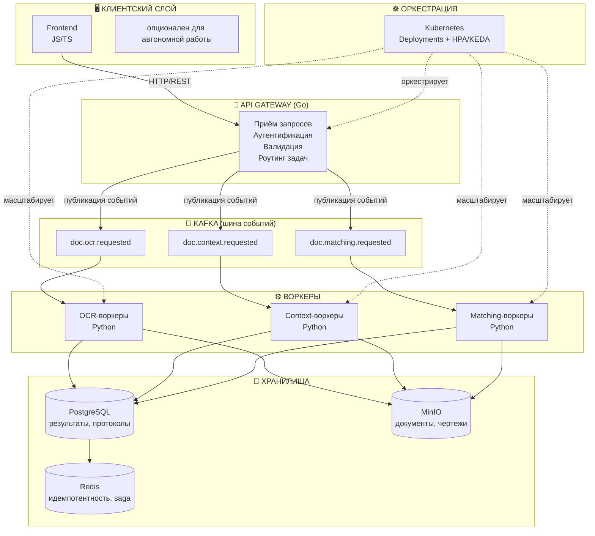

# Архитектура и бизнес-логика сервиса контроля документации

Документ описывает полный цикл работы системы: от приёма данных пользователем до формирования протокола несоответствий, включая работу event-driven ядра, масштабирование через K8s и обеспечение идемпотентности.

## 1. Общая архитектура компонентов



## 2. Структура кода Python-сервиса (воркеры)

Существующая заготовка реализует паттерн Ports & Adapters с DI-контейнером:

```
worker-service/
├── core/                       # ядро: DI, регистрация, жизненный цикл
│   ├── base_class/              # абстрактные контракты (Protocol)
│   ├── registry.py               # регистрация коннекторов/обработчиков
│   ├── factories.py              # сборка зависимостей по конфигу
│   ├── service_container.py      # DI-контейнер
│   ├── service_manager.py        # жизненный цикл сервисов ("Engine")
│   └── task_deduplication_queue.py
├── interface/                  # контракты (порты)
│   ├── db.py │ iqueue.py │ llm.py │ storage.py │ http.py
├── connectors/                  # реализации (адаптеры)
│   ├── kafka_connector.py │ pg_connector.py │ minio_connector.py
│   ├── gigachat_connector.py │ http_connector.py │ disc_ops_connector.py
├── services/                    # бизнес-логика (обработчики сценариев)
│   └── service.py                # → должен быть разбит по доменам
├── models/                       # схемы событий/данных
│   └── kafka_models.py │ domain_models.py │ connector_models.py
├── config/                       # конфигурация по окружениям
└── main.py                       # точка входа воркера
```

**Принцип:** коннектор реализует протокол → протокол лежит в `interface/` → DI собирает граф зависимостей по `worker_config` → `service_manager` держит нужные коннекторы предзагруженными ("не в спячке") для минимальной задержки старта обработки.

## 3. Событийный цикл: параллельная обработка OCR и анализа контекста

Ниже — детальный цикл на конкретном сценарии из ТЗ: в Kafka одновременно приходят задача OCR и задача анализа контекста для одного документа.

```
Kafka topic (partition key = document_id)
        │
        ▼
┌──────────────────────┐
│ Consumer читает        │
│ сообщение               │
└──────────┬───────────┘
           ▼
┌──────────────────────┐
│ Idempotency check      │
│ Redis SETNX по event_id │
└──────────┬───────────┘
     существует?
     да → skip, commit offset
     нет ↓
┌──────────────────────┐
│ EventHandler:            │
│ event_type → Service из  │
│ registry (уже "живой")   │
└──────────┬───────────┘
           ▼
┌──────────────────────┐
│ Service исполняет         │
│ бизнес-логику через        │
│ нужные коннекторы (DI)     │
└──────────┬───────────┘
           ▼
┌──────────────────────┐
│ Outbox: запись результата   │
│ в PG + событие в Kafka       │
│ (одна транзакция)             │
└──────────┬───────────┘
           ▼
┌──────────────────────┐
│ Redis: статус → done      │
│ Kafka: commit offset       │
└──────────────────────┘
```

**Параллельность.** `doc.ocr.requested` и `doc.context.requested` — разные топики с разными consumer group (`ocr-workers`, `context-workers`). Это физически независимые потоки: если контекст-анализ не зависит от результата OCR по данным ТЗ, оба обрабатываются одновременно, разными подами, без взаимной блокировки.

**Последовательная зависимость.** Если анализ контекста логически требует текста из OCR — тогда это не два параллельных события, а цепочка: завершение `doc.ocr.completed` триггерит публикацию `doc.context.requested`. Промежуточное состояние документа (`ocr_pending` → `ocr_done` → `context_pending` → `context_done`) хранится в Redis как saga-статус.

## 4. Идемпотентность — три уровня защиты

| Уровень | Механизм | От чего защищает |
|---|---|---|
| Партиционирование | `partition key = document_id` | Гонка между репликами по одному документу |
| Дедупликация | Redis `SETNX idempotency:{event_id}` с TTL | Повторная обработка при redelivery (at-least-once) |
| Коммит офсета | Manual commit только после успешной записи результата | Потеря/дублирование при падении пода в середине обработки |

TTL ключа в Redis должен превышать максимальное ожидаемое время обработки задачи (например, 2× от нормы), иначе зависшая задача не даст себя повторно взять в оборот после сбоя.

## 5. Масштабирование через K8s

- Каждый тип задачи — отдельный Kafka-топик → отдельный Deployment того же кода воркера, но с урезанным `worker_config` (активны только нужные коннекторы).
- KEDA ScaledObject триггерит HPA по длине очереди (consumer lag) конкретного топика.
- OCR стал бутылочным горлышком → K8s поднимает реплики только `ocr-worker`, не трогая `context-worker`.
- Верхний предел реплик (`maxReplicas`) и `cooldownPeriod` предотвращают резонансное масштабирование при кратковременных всплесках.

## 6. Сценарии, предусмотренные ТЗ

| # | Сценарий | Топик/событие | Ключевые компоненты |
|---|---|---|---|
| 1 | Загрузка документа (ПД/РД/ИД) пользователем | `doc.uploaded` | Gateway → MinIO → Kafka |
| 2 | Распознавание текста и таблиц | `doc.ocr.requested` → `doc.ocr.completed` | OCR-воркер, GigaChat-коннектор |
| 3 | Векторизация и распознавание чертежей | `doc.drawing.requested` → `doc.drawing.completed` | CV-воркер |
| 4 | Анализ контекста извлечённых данных | `doc.context.requested` → `doc.context.completed` | Context-воркер, LLM-коннектор |
| 5 | Сопоставление между стадиями (ПД↔РД↔ИД) | `doc.matching.requested` → `doc.matching.completed` | Matching-воркер |
| 6 | Классификация расхождений по критичности | `discrepancy.detected` | Discrepancy-воркер (правила + ML) |
| 7 | Формирование протокола несоответствий | `protocol.generated` | Protocol-service, PostgreSQL |
| 8 | Проверка инспектором (подтверждение/отклонение) | `inspector.decision` | Frontend → Gateway → PG |
| 9 | Дообучение моделей на решениях инспектора | периодический batch-джоб | ML training pipeline (отдельно от воркеров реального времени) |

## 7. Открытые вопросы для проработки

- Разделение `Gateway` и `Client API` на два сервиса — оправдано, если growth в нагрузке на приём файлов и на управление задачами будет расти неравномерно.
- Явное оформление `core/engine.py` как единой точки входа (переименование существующего `service_manager`) — архитектурная уборка, не новый слой.
- Transactional outbox между PostgreSQL и Kafka — обязателен для консистентности "записали результат — опубликовали событие".
- Разбиение `services/service.py` на доменные обработчики (`matching_service.py`, `discrepancy_service.py`, `protocol_service.py`) до роста монолитности.