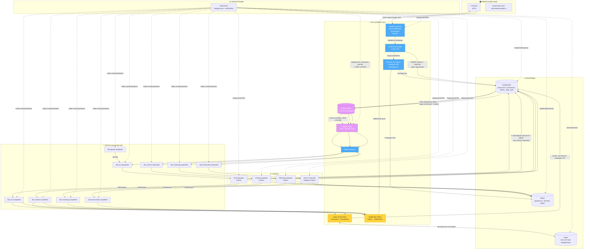
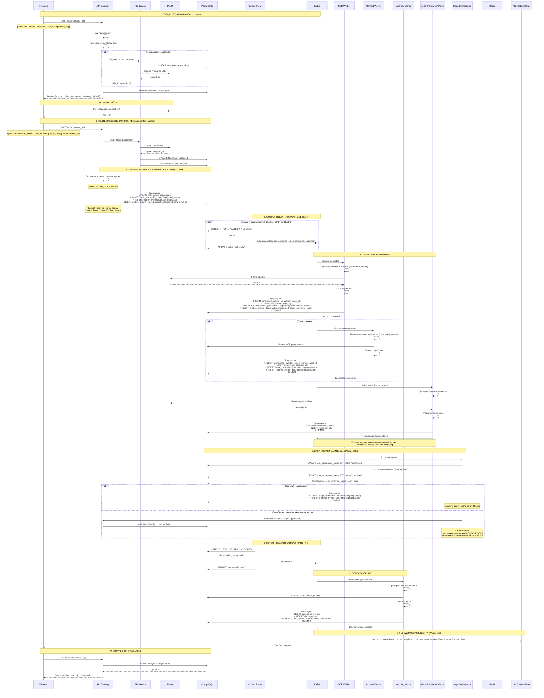
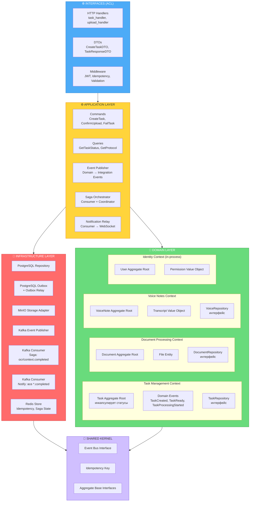

# Архитектура и бизнес-логика сервиса контроля документации

Документ описывает полный цикл работы системы: от приёма данных пользователем до формирования протокола несоответствий, включая работу event-driven ядра, масштабирование через K8s и обеспечение идемпотентности.

## Оглавление

1. [Общая архитектура компонентов](#общая-архитектура-компонентов)
2. [Поток обработки документа](#поток-обработки-документа)
3. [Структура frontend](#структура-frontend-fsd-architecture)
4. [Структура backend](#структура-backend-ddd-architecture)
5. [Структура шины событий](#структура-шины-событий)
6. [Структура воркеров](#структура-воркеров)
7. [Структура хранилищ](#структура-хранилищ)
8. [Структура системы оркестрации](#структура-системы-оркестрации)

---

## Общая архитектура компонентов



### Описание схемы компонентов

### 1. Клиентский слой

**Frontend (JS/TS)**

Веб-интерфейс инспектора, обеспечивающий:
- Просмотр документов (ПД/РД/ИД) в режиме side-by-side
- Подсветку расхождений на чертежах
- Подтверждение или отклонение расхождений в один клик
- **Запись и прикрепление голосовых заметок** к документам и протоколам

> **Примечание:** Frontend является **опциональным** компонентом. Система может работать полностью автономно через API (например, для интеграции с внешними системами или пакетной обработки).

---

### 2. API Gateway (Go)

**Единая точка входа** для всех внешних запросов.

**Функции:**
- **Приём запросов** — обработка HTTP/REST-запросов
- **Аутентификация** — проверка JWT-токенов и прав доступа (in-process, через Identity bounded context)
- **Валидация** — проверка входных данных (структура, типы, обязательные поля)
- **Роутинг задач** — маршрутизация запросов к соответствующим обработчикам
- **Outbox Relay** — отдельный процесс/под, читающий `outbox_events` с использованием `SELECT FOR UPDATE SKIP LOCKED` для атомарного claim'а записей; публикует их в Kafka
- **Saga Orchestrator** — координация распределённых процессов (слушает `doc.ocr.completed` / `doc.context.completed`, записывает durable-состояние и команды в PostgreSQL, запускает Matching через Outbox)
- **Notification Relay** — транслирует completion-события (`*.completed`) в WebSocket для клиента; независим от Saga и не влияет на бизнес-логику координации

**Технические детали:**
- Реализован на **Go** для высокой производительности и низкой задержки
- Масштабируется горизонтально через **Deployment + HPA**
- Saga Orchestrator и Notification Relay работают в том же процессе, что и Gateway (общий под, отдельные consumer-группы для каждого)
- **Outbox Relay — несколько реплик**, использующих атомарный claim через `SELECT FOR UPDATE SKIP LOCKED`, что обеспечивает высокую доступность и исключает единую точку отказа

---

### 3. Kafka (шина событий)

**Масштабируемый брокер сообщений** для асинхронной коммуникации между компонентами.

**Топики:**

| Топик | Назначение | Producer | Consumer |
|-------|------------|----------|----------|
| `doc.ocr.requested` | Запрос на OCR | Outbox Relay | OCR Worker |
| `doc.context.requested` | Запрос на Context | Outbox Relay (после OCR) | Context Worker |
| `doc.matching.requested` | Запрос на Matching | Outbox Relay (через saga_commands) | Matching Worker |
| `voice.transcribe.requested` | Запрос на транскрибацию | Outbox Relay | Voice Worker |
| `doc.ocr.completed` | OCR завершён | OCR Worker | Saga, Notification Relay |
| `doc.context.completed` | Context завершён | Context Worker | Saga, Notification Relay |
| `doc.matching.completed` | Matching завершён | Matching Worker | Notification Relay |
| `voice.transcribe.completed` | Транскрибация завершена | Voice Worker | Notification Relay |
| `file.upload.completed` | Файл загружен | File Service | — (триггер) |

> **Важно:** `doc.matching.completed` и `voice.transcribe.completed` **не потребляются Saga** — Saga гейтит только запуск Matching, для которого нужны исключительно `doc.ocr.completed` и `doc.context.completed`. Оба события идут напрямую в Notification Relay для доставки клиенту в реальном времени.

**Преимущества использования:**
- Асинхронная обработка длительных задач (OCR, CV, сопоставление, транскрибация)
- Слабая связанность сервисов
- Возможность репликации и отказоустойчивости
- Масштабирование через **кластер Kafka** и увеличение количества партиций
- **Saga-координация** через completion-события

---

### 4. Воркеры (Python)

**Специализированные обработчики задач**, каждый из которых подписан на свой топик Kafka.

#### 4.1 OCR-воркеры
**Назначение:**
- Распознавание текста на документах (OCR)
- Извлечение таблиц и текстовых блоков
- Векторизация графических элементов на чертежах (CV)
- **Публикация `doc.ocr.completed`** после завершения
- **Создание `doc.context.requested` в Outbox** в той же транзакции (если Context требуется)

**Технологии:** Python, ML-модели (Tesseract, EasyOCR, OpenCV)

**Идемпотентность:**
- Запись в `consumed_events` с `event_id`
- Уникальный индекс `(task_id, processing_version)` на результатах

---

#### 4.2 Context-воркеры
**Назначение:**
- Структурирование распознанного текста
- Привязка сущностей к разделам и страницам
- Извлечение контекстной информации (номера чертежей, спецификации, размеры)
- **Публикация `doc.context.completed`** после завершения
- **Создание `saga_commands` + `doc.matching.requested` в Outbox** в той же транзакции

**Технологии:** Python, NER-модели, обработка естественного языка

**Идемпотентность:**
- Запись в `consumed_events` с `event_id`
- Уникальный индекс `(task_id, processing_version)` на результатах

---

#### 4.3 Matching-воркеры
**Назначение:**
- Сопоставление документов разных стадий (ПД ↔ РД, РД ↔ ИД)
- Сравнение текст ↔ текст, текст ↔ графика, графика ↔ графика
- Классификация расхождений по критичности
- **Публикация `doc.matching.completed`** после завершения

**Технологии:** Python, ML-модели сопоставления, векторные базы данных

**Идемпотентность:**
- Запись в `consumed_events` с `event_id`
- Уникальный индекс `(task_id, processing_version)` на расхождениях

---

#### 4.4 Voice Transcribe-воркеры
**Назначение:**
- Транскрибация голосовых заметок инспекторов
- Преобразование речи в текст (Speech-to-Text)
- Извлечение ключевых фраз и сущностей из аудио
- Привязка транскрибированного текста к протоколам и документам
- **Публикация `voice.transcribe.completed`** после завершения

**Технологии:** Python, Speech-to-Text модели (Whisper, Vosk, или облачные API)

> **Архитектурная особенность:** Voice Transcribe — **независимый параллельный процесс**, не входящий в цепочку OCR → Context → Matching. Его завершение не гейтит запуск Matching и не является частью saga-состояния для сопоставления документов. Результат транскрипции доставляется клиенту через Notification Relay сразу по готовности и присоединяется к протоколу/задаче асинхронно.

**Идемпотентность:**
- Запись в `consumed_events` с `event_id`
- Уникальный индекс `(task_id, voice_id)` на результатах

---

### 5. Хранилища

#### 5.1 PostgreSQL
**Назначение:**
- Хранение метаданных документов
- Сохранение результатов распознавания и структурирования
- Хранение протоколов несоответствий
- Хранение транскрибированных текстов голосовых заметок
- Журналирование действий инспекторов
- **Outbox-таблица** для атомарной публикации событий
- **Durable-состояние Saga** (`task_processing_steps`)
- **Команды Saga** (`saga_commands`)
- **Идемпотентность consumer'ов** (`consumed_events`)

**Масштабирование:** StatefulSet с репликами (read replicas для аналитики)

---

#### 5.2 MinIO (S3-совместимое хранилище)
**Назначение:**
- Хранение исходных документов (PDF, DWG, изображения)
- Хранение обработанных файлов (распознанные тексты, размеченные чертежи)
- Хранение экспортированных протоколов
- **Хранение аудиофайлов голосовых заметок**
- Хранение результатов транскрибации в текстовом формате

**Масштабирование:** StatefulSet с репликами, распределённое хранилище

---

#### 5.3 Redis
**Назначение:**
- **Быстрый runtime state и coordination layer** для Saga (кэш состояния)
- **Не является источником истины** — все финальные решения принимаются на основе PostgreSQL
- При потере Redis состояние восстанавливается из PostgreSQL
- Кэширование часто запрашиваемых данных
- **Кэширование результатов транскрибации** для быстрого доступа

**Масштабирование:** Redis Sentinel или кластер для отказоустойчивости

---

### 6. Оркестрация (Kubernetes)

**Kubernetes** обеспечивает полное управление всеми компонентами системы.

#### Стратегии масштабирования:

| Компонент | Тип ресурса | Механизм масштабирования |
|-----------|-------------|--------------------------|
| **API Gateway (HTTP + Saga + Notify)** | Deployment | HPA по CPU/RPS |
| **Outbox Relay** | Deployment | **Несколько реплик с SKIP LOCKED** (обеспечивает HA) |
| **OCR-воркеры** | Deployment | HPA/KEDA по длине очереди Kafka |
| **Context-воркеры** | Deployment | HPA/KEDA по длине очереди Kafka |
| **Matching-воркеры** | Deployment | HPA/KEDA по длине очереди Kafka |
| **Voice Transcribe-воркеры** | Deployment | HPA/KEDA по длине очереди Kafka |
| **Kafka** | StatefulSet | Кластер + партиции |
| **PostgreSQL** | StatefulSet | Реплики (primary + read replicas) |
| **MinIO** | StatefulSet | Распределённый режим (erasure coding) |
| **Redis** | StatefulSet | Sentinel/кластер |

---

### Поток обработки документа



---

### Ключевые особенности архитектуры

1. **Асинхронная обработка** — длительные задачи не блокируют API
2. **Слабая связанность** — сервисы общаются через Kafka
3. **Горизонтальное масштабирование** — каждый компонент масштабируется независимо
4. **Отказоустойчивость** — репликация и кластеризация критичных компонентов
5. **Автоматическое масштабирование** — HPA/KEDA по метрикам и длине очереди
6. **Идемпотентность** — at-least-once доставка с идемпотентной обработкой, дающая **effectively-once бизнес-эффект**
7. **Мультимодальная обработка** — поддержка текстовых, графических и аудиоданных
8. **Голосовые заметки** — независимый параллельный Speech-to-Text процесс, не блокирующий Matching
9. **Saga-координация** — Matching запускается только после завершения ожидаемых шагов (OCR, Context), состав шагов динамический; вся координация через PostgreSQL durable state
10. **Outbox pattern** — атомарная публикация событий через PostgreSQL, Relay с несколькими репликами и `SKIP LOCKED`
11. **Real-time уведомления** — Notification Relay транслирует completion-события в WebSocket
12. **PostgreSQL — источник истины** — Redis только для быстрого кэша/координации; при потере Redis состояние восстанавливается из PostgreSQL

---

### Требования к инфраструктуре

| Компонент | Минимальные требования |
|-----------|----------------------|
| **Kubernetes** | Версия 1.24+, поддержка HPA и KEDA |
| **Kafka** | 3+ брокера, `acks=all`, `min.insync.replicas=2`, идемпотентный producer |
| **PostgreSQL** | 2+ реплики, регулярный бэкап |
| **MinIO** | 4+ узла для erasure coding |
| **Redis** | 3+ ноды для Sentinel/кластера, AOF `appendfsync everysec` |
| **Мониторинг** | Prometheus + Grafana + OpenTelemetry |
| **GPU** | Опционально для ускорения ML-воркеров (OCR, Voice) |

---

## Структура frontend (FSD Architecture)

Фронтенд построен на **Feature-Sliced Design (FSD)** — методологии организации кода, основанной на слоях и слайсах (срезах по функциональности).

### 🏛️ Слои FSD (снизу вверх)

```
app/                    # Инициализация приложения
    ↓
pages/                  # Полные страницы (композиция слайсов)
    ↓
widgets/                # Крупные самостоятельные блоки UI
    ↓
features/               # Сценарии пользователя (бизнес-логика)
    ↓
entities/               # Бизнес-сущности
    ↓
shared/                 # Переиспользуемые утилиты
```

**Правило зависимости:** Слои зависят только от слоев ниже. Нельзя импортировать из верхних слоев в нижние.

---

### 🧱 Схема архитектуры FSD

```mermaid
graph TB
    subgraph App["📱 APP СЛОЙ"]
        AppInit[Инициализация<br>Router, Store, Providers]
        AppStyles[Глобальные стили]
        AppConfig[Конфигурация]
    end

    subgraph Pages["📄 PAGES СЛОЙ"]
        TaskCreatePage[Страница создания задачи]
        TaskListPage[Страница списка задач]
        TaskDetailPage[Страница деталей задачи]
        ProtocolPage[Страница протокола]
        AuthPage[Страница авторизации]
    end

    subgraph Widgets["🧩 WIDGETS СЛОЙ"]
        TaskForm[Форма создания задачи]
        TaskTable[Таблица задач]
        ProtocolViewer[Просмотр протокола]
        DocumentViewer[Просмотр документов]
        VoiceRecorder[Запись голоса]
        Notifications[Уведомления]
    end

    subgraph Features["⚡ FEATURES СЛОЙ"]
        CreateTask[Создание задачи]
        UploadFile[Загрузка файлов]
        TranscribeVoice[Транскрибация голоса]
        CompareDocs[Сопоставление документов]
        ExportProtocol[Экспорт протокола]
        AuthByJWT[Аутентификация]
    end

    subgraph Entities["📦 ENTITIES СЛОЙ"]
        TaskEntity[Задача]
        FileEntity[Файл]
        VoiceNoteEntity[Голосовая заметка]
        ProtocolEntity[Протокол]
        UserEntity[Пользователь]
    end

    subgraph Shared["🔧 SHARED СЛОЙ"]
        UI[UI Kit<br>Buttons, Inputs, Modals]
        API[API Client<br>Axios, Endpoints]
        Lib[Библиотеки<br>Utils, Hooks, Helpers]
        Config[Конфигурация<br>Env, Constants]
    end

    App --> Pages
    Pages --> Widgets
    Widgets --> Features
    Features --> Entities
    Entities --> Shared
    Widgets --> Entities
    Widgets --> Shared
    Features --> Shared

    classDef app fill:#ff6b6b,stroke:#c92a2a,color:#fff
    classDef pages fill:#4dabf7,stroke:#1971c2,color:#fff
    classDef widgets fill:#ffd43b,stroke:#e67700
    classDef features fill:#69db7c,stroke:#2b8a3e,color:#fff
    classDef entities fill:#d0bfff,stroke:#6741d9
    classDef shared fill:#ff922b,stroke:#d9480f,color:#fff

    class App app
    class Pages pages
    class Widgets widgets
    class Features features
    class Entities entities
    class Shared shared
```



---

### 📋 Описание слоев

#### 1. APP слой (app/)

**Ответственность:** Инициализация приложения, глобальные провайдеры, роутинг, стор.

**Что содержит:**
- **Инициализация** — настройка React приложения (ReactDOM.render)
- **Провайдеры** — обёртки для Router, Store, Theme, QueryClient
- **Роутинг** — глобальная конфигурация маршрутов (React Router)
- **Глобальный стор** — корневой Redux/Zustand стор
- **Глобальные стили** — CSS Reset, переменные, темы

**Принципы:**
- Никакой бизнес-логики, только техническая инициализация
- Не содержит UI-компонентов (кроме корневого App)
- Импортирует из всех нижних слоёв

---

#### 2. PAGES слой (pages/)

**Ответственность:** Полноценные страницы, композиция виджетов и фич.

**Что содержит:**
- **TaskCreatePage** — страница создания задачи (форма + загрузка)
- **TaskListPage** — страница списка задач (таблица + фильтры)
- **TaskDetailPage** — страница деталей задачи (статус + результаты)
- **ProtocolPage** — страница просмотра протокола
- **AuthPage** — страница авторизации

**Принципы:**
- Страницы — это композиция виджетов (сборка)
- Каждая страница соответствует одному URL-маршруту
- Страницы НЕ содержат бизнес-логики, только layout
- Страницы могут использовать хуки из features

---

#### 3. WIDGETS слой (widgets/)

**Ответственность:** Крупные самостоятельные блоки UI, которые могут использоваться на разных страницах.

**Что содержит:**
- **TaskForm** — форма создания задачи (для страниц создания и редактирования)
- **TaskTable** — таблица с пагинацией и сортировкой
- **ProtocolViewer** — визуализация протокола несоответствий
- **DocumentViewer** — просмотр документов side-by-side с подсветкой
- **VoiceRecorder** — запись голосовых заметок с визуализацией
- **Notifications** — система уведомлений

**Принципы:**
- Виджеты — самостоятельны и могут работать изолированно
- Не содержат бизнес-логики (только UI + локальное состояние)
- Используют фичи и сущности
- Могут быть переиспользованы на разных страницах

---

#### 4. FEATURES слой (features/)

**Ответственность:** Сценарии пользователя, бизнес-логика, взаимодействие с API.

**Что содержит:**
- **create-task** — весь сценарий создания задачи (форма, валидация, отправка)
- **upload-file** — загрузка файла через Presigned URL
- **transcribe-voice** — транскрибация голосовой заметки
- **compare-docs** — сопоставление документов
- **export-protocol** — экспорт протокола
- **auth-by-jwt** — аутентификация через JWT

**Принципы:**
- Каждая фича — это самостоятельный сценарий
- Фичи содержат свою модель (state), API-вызовы, UI-компоненты
- Фичи не зависят друг от друга
- Используют сущности и shared

---

#### 5. ENTITIES слой (entities/)

**Ответственность:** Бизнес-сущности, их типы, валидация, базовые операции.

**Что содержит:**
- **Task** — сущность задачи (типы, статусы, валидация)
- **File** — сущность файла (метаданные, статусы)
- **VoiceNote** — сущность голосовой заметки
- **Protocol** — сущность протокола
- **User** — сущность пользователя

**Принципы:**
- Описывают предметную область
- Содержат типы, константы, базовые утилиты
- Не содержат UI
- Могут использоваться во всех верхних слоях

---

#### 6. SHARED слой (shared/)

**Ответственность:** Переиспользуемые утилиты, UI-кит, API-клиент.

**Что содержит:**
- **UI Kit** — кнопки, инпуты, селекты, модалки (без бизнес-логики)
- **API Client** — Axios, endpoints, interceptors
- **Helpers** — date, format, validation, blob
- **Hooks** — универсальные хуки (useDebounce, useLocalStorage)
- **Constants** — глобальные константы
- **Config** — работа с env-переменными

**Принципы:**
- Самый нижний слой, не зависит ни от чего
- Только переиспользуемый код
- UI-кит без привязки к предметной области

---

### 🔄 Поток данных в FSD

```
User Interaction (UI)
    ↓
Widget/Page (вызывает Feature)
    ↓
Feature (содержит бизнес-логику)
    ↓
Entity (валидация, преобразование)
    ↓
Shared/API (HTTP запрос)
    ↓
Backend
```

**Обратный поток:**

```
Backend Response
    ↓
Shared/API (парсинг)
    ↓
Entity (маппинг в сущность)
    ↓
Feature (обновление состояния)
    ↓
Widget/Page (рендеринг)
    ↓
User Interface
```

---

### 🎙️ Особенности: Voice Transcribe Feature

**Feature:** `transcribe-voice`

**Сценарий:**
1. Пользователь нажимает кнопку "Записать"
2. Запускается MediaRecorder (браузерный API)
3. После остановки аудио конвертируется в WebM/WAV
4. Аудио загружается через Presigned URL в MinIO
5. Отправляется запрос на транскрибацию
6. Результат приходит через WebSocket (от Notification Relay)
7. Транскрипт отображается в UI

**Архитектура фичи:**

```
features/transcribe-voice/
├── ui/
│   ├── VoiceRecorderWidget.tsx    # UI компонент
│   └── TranscriptDisplay.tsx      # Отображение транскрипта
├── model/
│   ├── voiceSlice.ts              # Состояние (запись, статус)
│   └── voiceSelectors.ts          # Селекторы
├── api/
│   └── voiceApi.ts                # Запросы на транскрибацию
└── lib/
    └── audioProcessor.ts          # Конвертация аудио
```

---

### 📡 Real-time обновления (WebSocket)

**Подход в FSD:**

WebSocket реализован на уровне **Shared**, но используется в **Features**. Источником событий на бэкенде является **Notification Relay** (см. backend-раздел) — отдельный consumer, транслирующий `*.completed` из Kafka в WebSocket, независимо от Saga-координации:

```
shared/lib/websocket/
├── WebSocketClient.ts      # Подключение, переподключение
└── types.ts                # Типы событий

features/task-status/
├── model/
│   └── taskStatusSlice.ts  # Обновление статуса через WebSocket
└── lib/
    └── taskStatusListener.ts # Подписка на события
```

**События WebSocket:**
- `task.status.updated` — обновление статуса задачи
- `task.progress.updated` — обновление прогресса (OCR/Context/Matching завершены)
- `voice.transcribe.completed` — транскрибация завершена
- `notification.new` — новое уведомление

---

### 🧪 Тестирование в FSD

| Слой | Что тестируем | Инструменты |
|------|---------------|-------------|
| **shared** | UI Kit, Helpers, API Client | Jest, React Testing Library |
| **entities** | Типы, валидация, преобразование | Jest |
| **features** | Сценарии, состояние, API | Jest + MSW |
| **widgets** | UI + взаимодействие | React Testing Library |
| **pages** | Интеграция страниц | React Testing Library + MSW |
| **app** | Роутинг, провайдеры | React Testing Library |

---

### 🔗 Связь с бэкенд-архитектурой

| FSD слой | Бэкенд слой | Коммуникация |
|----------|-------------|--------------|
| **shared** | — | API Client → HTTP / WebSocket |
| **entities** | Domain (Entities) | Типы соответствуют DTO |
| **features** | Application (Use-cases) | API вызовы → REST/gRPC |
| **pages** | — | Композиция фич |
| **widgets** | — | UI блоки |

**Маппинг DTO → Entity → Feature:**

```
Backend DTO (JSON)
    ↓ shared/api (получение)
    ↓ entities/task (маппинг в сущность)
    ↓ features/create-task (использование)
    ↓ widgets/TaskForm (отображение)
```

---

### 📈 Масштабирование FSD

**Горизонтальное масштабирование:**
- **Микрофронтенды** (Module Federation) — разделение по доменам
- Каждый модуль — это самостоятельное FSD-приложение:
  - `task-module` — всё, что связано с задачами
  - `voice-module` — голосовые заметки
  - `auth-module` — аутентификация

**Оптимизация:**
- Lazy Loading страниц (React.lazy)
- Code Splitting по слайсам
- Tree-shaking для shared

---

## Структура backend (DDD Architecture)

Бэкенд построен на **Domain-Driven Design (DDD)** с четким выделением bounded contexts, агрегатов и слоев.

### 🏛️ Bounded Contexts

В системе выделены следующие контексты:

| Bounded Context | Ответственность | Агрегаты |
|---|---|---|
| **Task Management** | Жизненный цикл задачи, статусы, оркестрация событий | `Task` (корень) |
| **Document Processing** | Файлы, документы, привязка к MinIO | `Document`, `File` |
| **Voice Notes** | Голосовые заметки, транскрипция (независимый параллельный контекст) | `VoiceNote` |
| **Identity** | JWT, права доступа (in-process, без Kafka) | `User` |

**Task Management** — ядро (core domain), остальные — supporting domains. Gateway физически один сервис, но код должен отражать эти границы, чтобы потом при необходимости можно было выделить контекст в отдельный микросервис без переписывания бизнес-логики.

---

### 🧱 Схема архитектуры бэкенда (DDD)



---

### 🧩 Описание слоев

#### 1. Domain Layer (Бизнес-логика)

**Ответственность:** Чистая бизнес-логика, инварианты, правила предметной области.

**Принципы:**
- Доменный слой **ничего не импортирует** (чистая бизнес-логика)
- Сущности содержат поведение, а не только данные
- Агрегаты — корневые сущности, через которые происходит вся работа
- Value Objects неизменяемы и самовалидируемы
- Репозитории — только интерфейсы (Ports)

**Ключевые элементы:**

**Task Aggregate Root** — инкапсулирует переходы статусов, не позволяет менять их напрямую снаружи:

```go
// domain/task.go
type Task struct {
    id             TaskID
    status         TaskStatus
    taskType       TaskType
    expectedSteps  []ProcessingStep // напр. [OCR, Context] — определяется при создании
    events         []DomainEvent    // накопленные для публикации
}

func (t *Task) MarkReady() error {
    if t.status != StatusAccepted {
        return ErrInvalidTransition
    }
    t.status = StatusReady
    t.events = append(t.events, TaskReadyEvent{TaskID: t.id, ExpectedSteps: t.expectedSteps})
    return nil
}

func (t *Task) MarkFailed(reason string) error {
    if t.status == StatusCompleted {
        return ErrAlreadyCompleted
    }
    t.status = StatusFailed
    t.events = append(t.events, TaskFailedEvent{TaskID: t.id, Reason: reason})
    return nil
}
```

**Domain Events vs Integration Events:**

Это разделение критически важно:
- **Domain Event** (`TaskReady`) — живёт внутри контекста, синхронный, in-process.
- **Integration Event** (`doc.ocr.requested` в Kafka) — публикуется наружу, за пределы bounded context.

Маппинг между ними происходит в `application/event_publisher.go` — это то место, где реализуется логика "какие события публиковать в зависимости от task_type и process". Здесь же формируется `expectedSteps` — набор шагов, за которыми будет следить Saga (см. ниже).

---

#### 2. Application Layer (Use-cases)

**Ответственность:** Оркестрация use-case'ов, координация между доменом и инфраструктурой.

**Принципы:**
- Сервисы НЕ содержат бизнес-логики — только оркестрацию
- Каждый use-case — отдельный Command или Query
- Команды принимают DTO, возвращают DTO
- Валидация — проверка структуры и типов (защита от дурака)

**Ключевые элементы:**

**Command Handlers:**
- `CreateTaskCommand` — создание задачи
- `ConfirmUploadCommand` — подтверждение загрузки
- `StartProcessingCommand` — запуск обработки, фиксирует `expectedSteps` для Saga
- `FailTaskCommand` — перевод задачи в статус `failed` (вызывается Saga при ошибке)

**Query Handlers:**
- `GetTaskStatusQuery` — получение статуса
- `GetProtocolQuery` — получение протокола

**Event Publisher:**
- Маппинг Domain Events → Integration Events
- Решение, какие события публиковать в Kafka (в зависимости от task_type и process)
- Использует **Outbox pattern** для атомарной публикации

**Saga Orchestrator:**
- Слушает **только** `doc.ocr.completed` и `doc.context.completed` — шаги, обязательные для Matching
- **Voice Transcribe в saga-гейт не входит**: это независимый параллельный процесс, его завершение не блокирует запуск Matching
- При инициализации задачи получает `expectedSteps` (какие шаги реально были запрошены для конкретного `task_id`) и хранит их в PostgreSQL как durable-состояние
- Решает, когда запускать Matching (когда все `expectedSteps` завершены)
- При ошибке вызывает `FailTaskCommand` (через Application, не напрямую в агрегат)
- Инициирует компенсацию (см. ниже)
- **Все решения принимаются на основе PostgreSQL**, Redis используется только как быстрый кэш

**Notification Relay:**
- Слушает **все** `*.completed`-события (`doc.ocr.completed`, `doc.context.completed`, `doc.matching.completed`, `voice.transcribe.completed`)
- Транслирует их в WebSocket-сообщения для клиента
- Не участвует в бизнес-координации, не пишет в PostgreSQL/Redis saga-state — чисто presentation-слой поверх Kafka

---

#### 3. Infrastructure Layer (Инфраструктура)

**Ответственность:** Технические детали, реализация репозиториев, адаптеры.

**Принципы:**
- Реализует интерфейсы из Domain слоя
- Не содержит бизнес-логики
- Все внешние зависимости инкапсулированы

**Ключевые элементы:**
- **PostgreSQL Repository** — сохранение и загрузка агрегатов целиком
- **PostgreSQL Outbox** — таблица для атомарной публикации событий + отдельный Relay-процесс (несколько реплик с SKIP LOCKED)
- **MinIO Adapter** — Presigned URL, upload/download
- **Kafka Producer** — публикация Integration Events (через Outbox Relay, **никаких прямых публикаций**)
- **Kafka Consumer (Saga)** — чтение `doc.ocr.completed` / `doc.context.completed`
- **Kafka Consumer (Notify)** — чтение всех `*.completed`
- **Redis Store** — быстрый кэш для Saga-состояния (восстанавливается из PostgreSQL)

---

#### 4. Interfaces Layer (Anti-Corruption Layer)

**Ответственность:** Внешний контракт, маппинг HTTP ↔ DTO ↔ Commands.

**Принципы:**
- DTO из HTTP-запроса не должны "протекать" в domain-модели напрямую
- Хендлер транслирует DTO → Command (`CreateTaskCommand`)
- ACL защищает домен от внешних изменений

---

### 📋 Ubiquitous Language (Глоссарий)

Для единообразия терминов в коде, документации и Kafka-схемах формализован следующий глоссарий:

| Термин | Описание |
|--------|----------|
| **Task** | Задача на обработку документа/документов |
| **Task Status** | Состояние задачи: pending → accepted → ready → processing → completed/failed |
| **Task Type** | Тип задачи: upload_and_process, process_only, compare |
| **Expected Steps** | Динамический набор шагов (OCR/Context), которые Saga ожидает для конкретной задачи |
| **Document** | Документ (ПД/РД/ИД) |
| **File** | Физический файл, привязанный к документу |
| **Voice Note** | Голосовая заметка инспектора (независимый параллельный процесс) |
| **Transcript** | Транскрибированный текст из голосовой заметки |
| **Discrepancy** | Расхождение между документами |
| **Protocol** | Протокол несоответствий (сводка расхождений) |
| **Processing** | Этапы: OCR → Context → Matching (Voice — параллельно, вне гейта) |
| **Saga** | Координатор распределённого процесса (слушает completion-события OCR/Context) |
| **Notification Relay** | Consumer, транслирующий все completion-события в WebSocket |
| **Outbox** | Паттерн атомарной публикации событий через БД |
| **Idempotency Key** | Ключ для предотвращения дублирующей обработки |
| **Effectively-once** | At-least-once доставка + идемпотентная обработка = бизнес-эффект ровно один раз |

---

### 🎯 Ключевые DDD-паттерны

| Паттерн | Где используется |
|---------|------------------|
| **Aggregate Root** | Task, Document, VoiceNote — корневые агрегаты |
| **Value Object** | TaskStatus, TaskType, DocumentType, FileSize, Transcript |
| **Repository** | Интерфейсы для работы с агрегатами |
| **Domain Events** | TaskCreated, TaskReady, FileUploaded |
| **Integration Events** | doc.ocr.requested, doc.matching.requested |
| **Application Services** | Use-cases (CreateTask, ConfirmUpload) |
| **Saga/Process Manager** | Оркестрация OCR → Context → Matching (динамический гейт) |
| **Anti-Corruption Layer** | HTTP Handlers → DTO → Commands |
| **Shared Kernel** | EventBus, IdempotencyKey, AggregateBase |
| **Factory** | Создание агрегатов |
| **Outbox** | Атомарная публикация событий |

---

### 🔄 Поток данных в DDD

```
HTTP Request (JSON)
    ↓
Interfaces/Handler (парсинг DTO)
    ↓
Interfaces/Middleware (JWT, Idempotency)
    ↓
Application/Command (валидация, создание Command)
    ↓
Application/Handler (оркестрация)
    ↓
Domain/Aggregate (бизнес-логика, проверка инвариантов, expectedSteps)
    ↓
Domain/Event (генерация Domain Events)
    ↓
Application/EventPublisher (маппинг в Integration Events)
    ↓
Infrastructure/Outbox (сохранение в БД + событие в outbox, одна транзакция)
    ↓
Infrastructure/Outbox Relay (публикация в Kafka из outbox)
    ↓
Infrastructure/PostgreSQL (агрегат уже сохранён на этом этапе)
```

---

### 🔄 Saga Orchestrator (Координация процессов)

**Ответственность:** Управление распределёнными транзакциями между bounded contexts. Гейтит **только** запуск Matching.

**Принцип работы:**
1. При старте обработки задачи (`StartProcessingCommand`) Application формирует `expectedSteps` — динамический список: включён ли OCR, включён ли Context (на основе `task_type`/`process`). Voice в этот список **не входит**.
2. Saga слушает Integration Events: `doc.ocr.completed`, `doc.context.completed`
3. Хранит durable-состояние в PostgreSQL (`task_processing_steps`)
4. Redis используется только как быстрый кэш для проверки состояния
5. Когда **все шаги из expectedSteps** завершены — создаёт запись в `saga_commands` и `outbox_events` для Matching
6. При ошибке — инициирует компенсацию через `FailTaskCommand`

**Схема Saga:**

```
TaskCreated (Gateway)
    ↓
Application формирует expectedSteps для task_id, например: ["ocr", "context"]
(если Matching для задачи не нужен вовсе — Saga для неё не создаётся)
    ↓
Запуск OCR (если включён) → doc.ocr.requested
Запуск Context (если включён) → doc.context.requested (после OCR)
Запуск Voice (если включён) → voice.transcribe.requested  [ПАРАЛЛЕЛЬНО, вне Saga-гейта]
    ↓
Saga ожидает completion-события ТОЛЬКО по expectedSteps:
    - doc.ocr.completed      (если "ocr" ∈ expectedSteps)
    - doc.context.completed  (если "context" ∈ expectedSteps)
    ↓
Хранит durable-состояние в PostgreSQL:
    task_processing_steps (task_id, step, status)
    ↓
Redis кэширует это состояние для быстрых проверок
    ↓
Когда все expected steps завершены → создаёт:
    - saga_commands (doc.matching.requested)
    - outbox_events (doc.matching.requested)
    ↓
Outbox Relay → Kafka → Matching Worker
Если ошибка → FailTaskCommand (через Application, не напрямую)
```

**Компенсация при ошибке — что именно происходит:**
- Частичные результаты OCR/Context, уже сохранённые в PostgreSQL, **не удаляются** — они самодостаточны и валидны сами по себе (например, полезны для последующего ретрая только упавшего шага)
- Очищаются только временные/промежуточные артефакты в MinIO (черновые файлы конвертации, не финальные результаты)
- Причина ошибки и `task_id` логируются в PostgreSQL для последующего разбора
- Task переводится в статус `failed` через `task.MarkFailed()`, вызванный из `FailTaskCommand`

**Saga не трогает Task напрямую!** Она вызывает `FailTaskCommand` через Application Layer, который уже внутри вызывает метод агрегата `MarkFailed()`. Это сохраняет инвариант "агрегат — единственная точка изменений".

**Voice Transcribe и Notification Relay работают независимо от Saga** — их completion-события идут напрямую в Notification Relay и доставляются клиенту по WebSocket, не дожидаясь и не влияя на решение Saga о запуске Matching.

**Восстановление Redis из PostgreSQL:**
- При старте Saga-пода выполняется проверка незавершённых задач в `task_processing_steps`
- Состояние загружается в Redis для быстрого доступа
- При потере Redis (перезапуск, сбой) состояние восстанавливается из PostgreSQL

---

### 📦 Outbox Pattern (Атомарная публикация)

Для гарантии, что событие будет опубликовано ровно один раз и только после успешного сохранения агрегата, используется **Outbox pattern**:

```sql
-- Таблица outbox
CREATE TABLE outbox_events (
    event_id       UUID PRIMARY KEY,
    aggregate_id   UUID NOT NULL,
    aggregate_type TEXT NOT NULL,
    event_type     TEXT NOT NULL,
    schema_version SMALLINT NOT NULL DEFAULT 1,
    payload        JSONB NOT NULL,

    status         TEXT NOT NULL DEFAULT 'pending',
    attempts       INTEGER NOT NULL DEFAULT 0,
    available_at   TIMESTAMPTZ NOT NULL DEFAULT now(),
    locked_at      TIMESTAMPTZ,
    published_at   TIMESTAMPTZ,
    last_error     TEXT,

    created_at     TIMESTAMPTZ NOT NULL DEFAULT now()
);

CREATE INDEX outbox_pending_idx
ON outbox_events (available_at, created_at)
WHERE status IN ('pending', 'publishing', 'failed');
```

**Relay с несколькими репликами и SKIP LOCKED:**

```sql
WITH batch AS (
    SELECT event_id
    FROM outbox_events
    WHERE
        (
            status = 'pending'
            OR (
                status = 'publishing'
                AND locked_at < now() - interval '2 minutes'
            )
            OR (
                status = 'failed'
                AND available_at <= now()
            )
        )
    ORDER BY created_at
    FOR UPDATE SKIP LOCKED
    LIMIT 100
)
UPDATE outbox_events o
SET
    status = 'publishing',
    locked_at = now(),
    attempts = attempts + 1
FROM batch
WHERE o.event_id = batch.event_id
RETURNING o.*;
```

**После успешной публикации:**

```sql
UPDATE outbox_events
SET
    status = 'published',
    published_at = now(),
    locked_at = NULL
WHERE event_id = $1
  AND status = 'publishing';
```

**Критическое правило:** `event_id` создаётся **один раз при создании события** и никогда не меняется при retry.

**Преимущества:**
- Гарантия атомарности (либо всё сохранено, либо ничего)
- Возможность ретраев при сбоях Kafka
- Аудит всех событий
- **Высокая доступность** благодаря нескольким репликам с SKIP LOCKED

---

### 📡 Идемпотентность Consumer'ов

Каждый consumer должен атомарно записывать:

1. факт обработки события;
2. бизнес-результат;
3. исходящее событие, если оно есть.

**Таблица consumed_events:**

```sql
CREATE TABLE consumed_events (
    consumer_name TEXT NOT NULL,
    event_id      UUID NOT NULL,
    processed_at  TIMESTAMPTZ NOT NULL DEFAULT now(),
    PRIMARY KEY (consumer_name, event_id)
);
```

**Обработка события в воркере:**

```sql
BEGIN;

INSERT INTO consumed_events (consumer_name, event_id)
VALUES ('ocr-worker', :event_id)
ON CONFLICT DO NOTHING;
```

Если вставлено `0` строк — событие уже обработано:

```
ROLLBACK/COMMIT без повторного эффекта
ack Kafka message
```

Если вставлено `1` строка:

```
сохранить бизнес-результат
создать outbox-событие (completion)
COMMIT
ack Kafka message
```

**Ключевой момент:** запись в `consumed_events`, бизнес-результат и completion-событие должны находиться **в одной PostgreSQL-транзакции**.

**Дополнительная защита бизнес-ключом:**

```sql
CREATE UNIQUE INDEX ocr_result_once_idx ON ocr_results (task_id, processing_version);
CREATE UNIQUE INDEX context_result_once_idx ON context_results (task_id, processing_version);
CREATE UNIQUE INDEX matching_result_once_idx ON discrepancies (task_id, processing_version);
CREATE UNIQUE INDEX voice_result_once_idx ON voice_results (task_id, voice_id);
```

Для каждого шага должны быть определены:

```
task_id
step
processing_version
event_id
```

Повторный запуск той же версии не должен создать новый результат.

---

### 🗄️ Durable Saga State (PostgreSQL)

```sql
CREATE TABLE task_processing_steps (
    task_id          UUID NOT NULL,
    step             TEXT NOT NULL,
    status           TEXT NOT NULL,
    attempt          INTEGER NOT NULL DEFAULT 0,
    event_id         UUID,
    started_at       TIMESTAMPTZ,
    completed_at     TIMESTAMPTZ,
    failed_at        TIMESTAMPTZ,
    error_code       TEXT,
    error_message    TEXT,
    PRIMARY KEY (task_id, step)
);
```

Статусы:

```
pending
requested
running
completed
failed
```

### 📋 Saga Commands

```sql
CREATE TABLE saga_commands (
    command_id       UUID PRIMARY KEY,
    task_id          UUID NOT NULL,
    command_type     TEXT NOT NULL,
    status           TEXT NOT NULL DEFAULT 'pending',
    payload          JSONB NOT NULL,
    created_at       TIMESTAMPTZ NOT NULL DEFAULT now(),
    published_at     TIMESTAMPTZ,
    last_error       TEXT,
    UNIQUE (task_id, command_type)
);

-- Matching допускается только один раз для конкретной версии процесса
CREATE UNIQUE INDEX saga_matching_once
ON saga_commands (task_id, command_type)
WHERE command_type = 'doc.matching.requested';
```

### 🚀 Redis — быстрый кэш/координатор

**Redis-структура:**

```
saga:{task_id}
```

Значение:

```json
{
  "schema_version": 1,
  "task_id": "task-123",
  "process_version": 1,
  "expected": ["ocr", "context"],
  "completed": ["ocr"],
  "failed": [],
  "matching": "not_requested",
  "version": 4,
  "updated_at": "2026-08-19T18:00:00Z"
}
```

**Атомарная обработка completion-события через Lua-скрипт:**

При получении `doc.ocr.completed` Saga должна атомарно:

1. проверить, что событие ещё не обработано;
2. добавить `ocr` в completed;
3. проверить `completed == expected`;
4. установить `matching = requested`, если все шаги завершены;
5. вернуть решение: публиковать Matching или нет.

Lua-скрипт возвращает одно из состояний:

```
DUPLICATE
STEP_RECORDED_WAITING
READY_TO_DISPATCH_MATCHING
ALREADY_DISPATCHED
IGNORED
```

**Но Redis не является источником истины:**

- PostgreSQL — authoritative state
- Redis AOF `appendfsync everysec` — быстрый кэш/координатор
- При старте Saga проверяет незавершённые задачи в PostgreSQL
- Каждая completion-операция сначала защищена PostgreSQL unique constraint
- Redis можно безопасно пересоздать и восстановить

---

### 📡 Репозитории: Только для агрегатов

Один `TaskRepository`, не отдельные репозитории на каждую таблицу — сохраняет и загружает `Task` целиком как консистентную единицу.

```go
type TaskRepository interface {
    Save(ctx context.Context, task *Task) error
    FindByID(ctx context.Context, id TaskID) (*Task, error)
    FindByStatus(ctx context.Context, status TaskStatus) ([]*Task, error)
}
```

---

### 🔄 Retry & DLQ политика

| Компонент | Стратегия |
|-----------|-----------|
| **OCR Worker** | 3 попытки, интервал 5с → DLQ |
| **Context Worker** | 3 попытки, интервал 5с → DLQ |
| **Matching Worker** | 3 попытки, интервал 5с → DLQ |
| **Voice Worker** | 3 попытки, интервал 5с → DLQ |
| **Saga Consumer** | 5 попыток, интервал 10с → DLQ (критично для координации) |
| **Notification Relay Consumer** | 3 попытки, затем drop + метрика (не критично для консистентности) |
| **Outbox Publisher** | Бесконечные ретраи с экспоненциальной задержкой (до 60с) |

**DLQ топики:**
- `doc.ocr.dlq`
- `doc.context.dlq`
- `doc.matching.dlq`
- `voice.transcribe.dlq`
- `saga.dlq`

---

### 📦 Schema Versioning для Kafka

Все сообщения в Kafka имеют версию схемы (Avro/Protobuf + Schema Registry):

```json
{
  "schema_version": "v1",
  "event_id": "evt-123",
  "event_type": "doc.ocr.completed",
  "timestamp": "2026-08-19T10:30:00Z",
  "data": {
    "task_id": "task-123",
    "file_id": "file-456",
    "status": "success"
  }
}
```

**Правила:**
- Добавление новых полей — мажорная версия (v2)
- Удаление/переименование полей — мажорная версия (v2)
- Добавление опциональных полей — минорная версия (v1.1)
- Обратная совместимость обязательна

---

### 📊 OpenTelemetry Tracing

Трейсинг через всю цепочку:

```
Gateway (HTTP) → Outbox Relay → Kafka Broker → Worker → PostgreSQL/MinIO → Kafka Consumer (Saga / Notify)
```

**Span'ы:**
- `http.create_task` — входной запрос
- `outbox.relay` — чтение и публикация из outbox
- `kafka.produce` — публикация события
- `kafka.consume` — получение события воркером
- `worker.process` — обработка (OCR/Context/Matching/Voice)
- `saga.coordinate` — координация Saga
- `notify.relay` — трансляция в WebSocket
- `db.query` — запросы в PostgreSQL
- `minio.operation` — операции с MinIO

Все span'ы связаны через `trace_id`, передаваемый в заголовках Kafka-сообщений.

---

### 🔗 Связь с шиной событий (Kafka)

**Domain Events → Integration Events:**

| Domain Event | Integration Event | Топик | Кто читает |
|--------------|-------------------|-------|------------|
| `TaskCreated` | `TaskCreated` | (internal) | — |
| `TaskReady` | `doc.ocr.requested` | doc.ocr.requested | OCR Worker |
| `OCRCompleted` (если нужен Context) | `doc.context.requested` | doc.context.requested | Context Worker |
| `ContextCompleted` | `doc.matching.requested` | doc.matching.requested | Matching Worker |
| `TaskReady` | `voice.transcribe.requested` | voice.transcribe.requested | Voice Worker |
| `OCRCompleted` | `doc.ocr.completed` | doc.ocr.completed | Saga, Notification Relay |
| `ContextCompleted` | `doc.context.completed` | doc.context.completed | Saga, Notification Relay |
| `VoiceCompleted` | `voice.transcribe.completed` | voice.transcribe.completed | Notification Relay |
| `SagaMatchingReady` | `doc.matching.requested` | doc.matching.requested | Matching Worker |
| `MatchingCompleted` | `doc.matching.completed` | doc.matching.completed | Notification Relay |

---

## Структура шины событий

*Здесь будет описание топиков и схем событий*

## Структура воркеров

*Здесь будет детальное описание каждого воркера*

## Структура хранилищ

*Здесь будет описание схем БД и структур хранения*

## Структура системы оркестрации

*Здесь будет описание Kubernetes манифестов и конфигураций*
