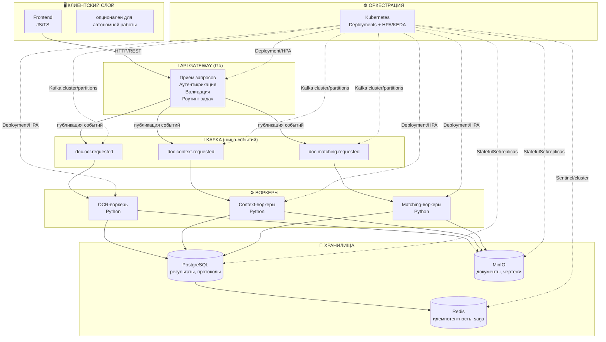
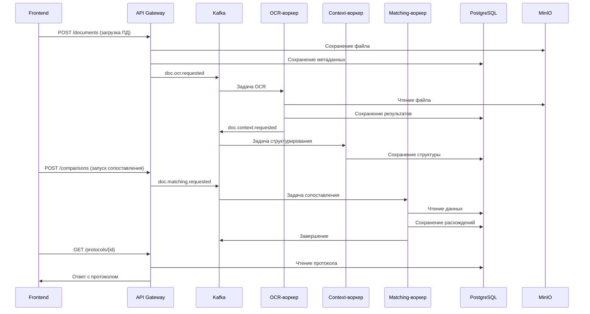

# Архитектура и бизнес-логика сервиса контроля документации

Документ описывает полный цикл работы системы: от приёма данных пользователем до формирования протокола несоответствий, включая работу event-driven ядра, масштабирование через K8s и обеспечение идемпотентности.

## Оглавление

1. [Общая архитектура компонентов](#общая-архитектура-компонентов)

## Общая архитектура компонентов

## Описание схемы компонентов

## 1. Клиентский слой

**Frontend (JS/TS)**

Веб-интерфейс инспектора, обеспечивающий:
- Просмотр документов (ПД/РД/ИД) в режиме side-by-side
- Подсветку расхождений на чертежах
- Подтверждение или отклонение расхождений в один клик

> **Примечание:** Frontend является **опциональным** компонентом. Система может работать полностью автономно через API (например, для интеграции с внешними системами или пакетной обработки).

---

## 2. API Gateway (Go)

**Единая точка входа** для всех внешних запросов.

**Функции:**
- **Приём запросов** — обработка HTTP/REST-запросов
- **Аутентификация** — проверка JWT-токенов и прав доступа
- **Валидация** — проверка входных данных (структура, типы, обязательные поля)
- **Роутинг задач** — маршрутизация запросов к соответствующим обработчикам

**Технические детали:**
- Реализован на **Go** для высокой производительности и низкой задержки
- Масштабируется горизонтально через **Deployment + HPA**
- При необходимости может быть разделён на два компонента:
  - **Gateway** — обработка внешних запросов
  - **Client(internal) API** — внутренний API для коммуникации с сервисами

---

## 3. Kafka (шина событий)

**Масштабируемый брокер сообщений** для асинхронной коммуникации между компонентами.

**Топики:**
| Топик | Назначение |
|-------|------------|
| `doc.ocr.requested` | Запрос на распознавание текста (OCR) |
| `doc.context.requested` | Запрос на структурирование и извлечение контекста |
| `doc.matching.requested` | Запрос на сопоставление документов |

**Преимущества использования:**
- Асинхронная обработка длительных задач (OCR, CV, сопоставление)
- Слабая связанность сервисов
- Возможность репликации и отказоустойчивости
- Масштабирование через **кластер Kafka** и увеличение количества партиций

**Обеспечение идемпотентности, целостности задач, гарантированного единоразового исполнения между разными топиками**:

---

## 4. Воркеры (Python)

**Специализированные обработчики задач**, каждый из которых подписан на свой топик Kafka.

### 4.1 OCR-воркеры
**Назначение:**
- Распознавание текста на документах (OCR)
- Извлечение таблиц и текстовых блоков
- Векторизация графических элементов на чертежах (CV)

**Технологии:** Python, ML-модели (Tesseract, EasyOCR, OpenCV)

---

### 4.2 Context-воркеры
**Назначение:**
- Структурирование распознанного текста
- Привязка сущностей к разделам и страницам
- Извлечение контекстной информации (номера чертежей, спецификации, размеры)

**Технологии:** Python, NER-модели, обработка естественного языка

---

### 4.3 Matching-воркеры
**Назначение:**
- Сопоставление документов разных стадий (ПД ↔ РД, РД ↔ ИД)
- Сравнение текст ↔ текст, текст ↔ графика, графика ↔ графика
- Классификация расхождений по критичности

**Технологии:** Python, ML-модели сопоставления, векторные базы данных

---

## 5. Хранилища

### 5.1 PostgreSQL
**Назначение:**
- Хранение метаданных документов
- Сохранение результатов распознавания и структурирования
- Хранение протоколов несоответствий
- Журналирование действий инспекторов

**Масштабирование:** StatefulSet с репликами (read replicas для аналитики)

---

### 5.2 MinIO (S3-совместимое хранилище)
**Назначение:**
- Хранение исходных документов (PDF, DWG, изображения)
- Хранение обработанных файлов (распознанные тексты, размеченные чертежи)
- Хранение экспортированных протоколов

**Масштабирование:** StatefulSet с репликами, распределённое хранилище

---

### 5.3 Redis
**Назначение:**
- **Идемпотентность** — предотвращение дублирующей обработки
- **Saga-состояние** — управление распределёнными транзакциями
- Кэширование часто запрашиваемых данных

**Масштабирование:** Redis Sentinel или кластер для отказоустойчивости

---

## 6. Оркестрация (Kubernetes)

**Kubernetes** обеспечивает полное управление всеми компонентами системы.

### Стратегии масштабирования:

| Компонент | Тип ресурса | Механизм масштабирования |
|-----------|-------------|--------------------------|
| **API Gateway** | Deployment | HPA по CPU/RPS |
| **OCR-воркеры** | Deployment | HPA/KEDA по длине очереди Kafka |
| **Context-воркеры** | Deployment | HPA/KEDA по длине очереди Kafka |
| **Matching-воркеры** | Deployment | HPA/KEDA по длине очереди Kafka |
| **Kafka** | StatefulSet | Кластер + партиции |
| **PostgreSQL** | StatefulSet | Реплики (primary + read replicas) |
| **MinIO** | StatefulSet | Распределённый режим (erasure coding) |
| **Redis** | StatefulSet | Sentinel/кластер |

---

## Поток обработки документа

---

## Ключевые особенности архитектуры

1. **Асинхронная обработка** — длительные задачи не блокируют API
2. **Слабая связанность** — сервисы общаются через Kafka
3. **Горизонтальное масштабирование** — каждый компонент масштабируется независимо
4. **Отказоустойчивость** — репликация и кластеризация критичных компонентов
5. **Автоматическое масштабирование** — HPA/KEDA по метрикам и длине очереди
6. **Идемпотентность** — гарантия однократной обработки через Redis

---

## Требования к инфраструктуре

| Компонент | Минимальные требования |
|-----------|----------------------|
| **Kubernetes** | Версия 1.24+, поддержка HPA и KEDA |
| **Kafka** | 3+ брокера, 3+ партиций на топик |
| **PostgreSQL** | 2+ реплики, регулярный бэкап |
| **MinIO** | 4+ узла для erasure coding |
| **Redis** | 3+ ноды для Sentinel/кластера |
| **Мониторинг** | Prometheus + Grafana |

---

Это описание можно использовать в **архитектурной документации**, **README.md** или **презентации** для заказчика. Хотите дополнить какие-то разделы? 😊